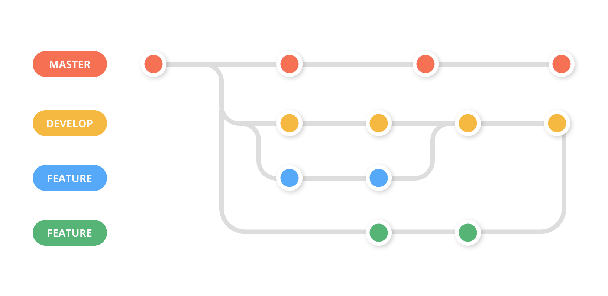

# Buổi 4: Mọi thứ đều là đối tượng
##1. Tính đóng gói
###a. Tính đóng gói là gì
- **Tính đóng gói (Encapsulation)** là một trong những nguyên tắc quan trọng trong Lập Trình Hướng Đối Tượng (OOP). Nguyên tắc này đề cập đến việc **che giấu thông tin và hành vi bên trong đối tượng**, chỉ tiết lộ những gì cần thiết và quy định cách truy cập thông qua các phương thức công khai. 
###b. Vì sao cần tính đóng gói
- Trong lập trình, tính đóng gói giúp **bảo vệ dữ liệu và tránh truy cập trực tiếp** đến các thuộc tính của đối tượng từ bên ngoài. Điều này có ích trong việc **quản lý và bảo vệ dữ liệu**, đồng thời cho phép kiểm soát cách các thành phần khác nhau tương tác với đối tượng đó.
###c. Ví dụ:
- Trong ví dụ này, thuộc tính name và age được khai báo là private, nghĩa là chúng không thể truy cập trực tiếp từ bên ngoài lớp Person. 
```java
public class Dog {
    private String name;
    private int age;
}
```
- Để lấy hoặc thay đổi giá trị của chúng, chúng ta sử dụng các phương thức công khai getName và setAge.
```java
public class Dog {
    protected String name;
    protected int age;
    Dog(String name, int age){
        this.name = name;
        this.age = age;
    }
    public String getName(){
        return this.name;
    }
    public int getAge(){
        return age;
    }
    public void setAge(int age){
        this.age = age;
    }
    public static void main(String[] args) {
        Dog dog = new Dog("Mix", 8);
        System.out.println(dog.getName());
        dog.setAge(10);
        System.out.println(dog.getAge());
    }
}
=> Output: Mix 10
```
-  Vì vậy, thông tin được che giấu bên trong lớp Dog, và chỉ có thể truy cập thông qua các phương thức công khai. Điều này giúp đảm bảo rằng **dữ liệu không bị sửa đổi hoặc truy cập một cách không kiểm soát.**
##2. Tính kế thừa trong Java
###a. Tính kế thừa là gì?
- **Kế thừa (Inheritance)** là một trong những khía cạnh quan trọng nhất của Lập Trình Hướng Đối Tượng (OOP). Nó cho phép bạn **tạo ra các lớp mới bằng cách sử dụng thông tin và hành vi từ các lớp đã tồn tại.**
###b. Vì sao cần kế thừa
- Tính kế thừa giúp **tái sử dụng mã nguồn và tạo ra cấu trúc phân cấp cho các lớp.** Điều này cho phép bạn xây dựng các lớp mới trên cơ sở của các lớp đã có, tiết kiệm thời gian và công sức, đồng thời duy trì tính nhất quán trong mã nguồn.
###c. Cú pháp
```java
class Subclass-name extends Superclass-name{
    //methods and fields
}
```
- Ví dụ:
```java
class Cho{
    private int tuoi;
    private String ten;
    public void keu(){
        System.out.println("Hi Hi");
    }
    Cho(String ten, int tuoi){
        this.ten = ten;
        this.tuoi = tuoi;
    }
}
class ChoBeo extends Cho{
    private String mau;
    //Kế thừa Constructor
    ChoBeo(String ten, String mau, int tuoi){
        //Kế thừa thuộc tính
        super(ten, tuoi);
        this.mau = mau;
    }
}
public class Dog {
    public static void main(String[] args) {
        ChoBeo choBeo = new ChoBeo("Gay", "Xanh", 5);
        //Kế thừa phương thức
        choBeo.keu();
    }
}
```
###d. Các kiểu kế thừa
- Có 3 kiểu kế thừa trong java đó là đơn kế thừa, kế thừa nhiều cấp, kế thừa thứ bậc.

- **Đơn kế thừa**: Một lớp con kế thừa với một lớp cha.
```java
class Cho{
    public void keu(){
        System.out.println("Hi Hi");
    }
}
class ChoDom extends Cho {
    public void sua(){
        System.out.println("Ha Ha");
    }
}
public class Dog {
    public static void main(String[] args) {
        ChoDom choDom = new ChoDom();
        choDom.keu();
        choDom.sua();
    }
}
Output: Hi Hi
        Ha Ha
```
- **Kế thừa nhiều tầng**: Các lớp nối đuôi nhau kế thừa.
```java
class Cho{
    public void keu(){
        System.out.println("Hi Hi");
    }
}
class ChoDom extends Cho {
    public void sua(){
        System.out.println("He He");
    }
}
class ChoDomBeo extends ChoDom{
    public void can(){
        System.out.println("Ha Ha");
    }
}
public class Dog {
    public static void main(String[] args) {
        ChoDomBeo choDomBeo = new ChoDomBeo();
        choDomBeo.keu();
        choDomBeo.sua();
        choDomBeo.can();
    }
}
Output: Hi Hi
        He He
        Ha Ha
```
- **Kế thừa thứ bậc**: Hai lớp con kế thừa 1 lớp cha.
```java
class Cho{
    public void keu(){
        System.out.println("Hi Hi");
    }
}
class ChoDom extends Cho {
    public void sua(){
        System.out.println("He He");
    }
}
class ChoBeo extends Cho{
    public void can(){
        System.out.println("Ha Ha");
    }
}
public class Dog {
    public static void main(String[] args) {
        ChoBeo choBeo = new ChoBeo();
        choBeo.keu();
        choBeo.can();
    }
}
Output: Ha Ha
        He He
```
> **Không có đa kế thừa**: Có 3 lớp A, B, C. Trong đó lớp C kế thừa từ các lớp A và B. Nếu các lớp A và B có phương thức giống nhau và bạn gọi nó từ đối tượng của lớp con, như vậy khó có thể xác đinh được việc gọi phương thức của lớp A hay B.
##3. Tính đa hình
###a. Tính đa hình là gì?
- **Tính đa hình (Polymorphism)** là một khía cạnh quan trọng trong Lập Trình Hướng Đối Tượng (OOP). Nó cho phép bạn thực hiện cùng một hành động trên các đối tượng khác nhau mà không cần quan tâm đến loại đối tượng cụ thể.
###b. Vì sao cần tính đa hình
- Tính đa hình giúp tạo ra **mã nguồn linh hoạt và dễ bảo trì**. Nó cho phép bạn viết các phương thức chung mà có thể được sử dụng trên nhiều lớp khác nhau, **giúp giảm sự lặp lại mã và tạo ra mã nguồn dễ mở rộng.**
###c. Ví dụ:
- Đa hình trong lúc thực thi là ta ghi đè các phương thức của lớp cha bằng phương thức y hệt về tên và tham số trong lớp con.
```java
class Cho{
    public void sua(){
        System.out.println("Hi Hi");
    }
}
class ChoBeo extends Cho{
    public void sua(){
        System.out.println("Ha Ha");
    }
}
class ChoGay extends Cho{
    public void sua(){
        System.out.println("He He");
    }
}
public class Dog {
    public static void main(String[] args) {
        Cho choBeo = new ChoBeo();
        Cho choGay = new ChoGay();
        choBeo.sua();
        choGay.sua();
    }
}
Output: Ha Ha
        He He
```
- Đa hình trong lúc biên dịch là việc ta nạp chồng các phương thức, các phương thức có thể cùng tên, nhưng số lượng hay kiểu biến truyền vào phải khác nhau

##Note:
- instanceof có thể xem coi lớp con là của lớp cha nào
- từ khóa auto trong c++ thay bằng var trong java
- **Ép kiểu**:
+ up - casting: Tự động ép kiểu cho mình, sẽ là ép kiểu cha về con.
```java
int a = 5;
float b = a;
```
+ down - casting: Ép kiểu thủ công, phải thêm (<Kiểu dữ liệu>), ép kiểu con lên cha.
```java
float a = 5.5f;
int b = (int)a;
//Lỗi: int b = a;
```
