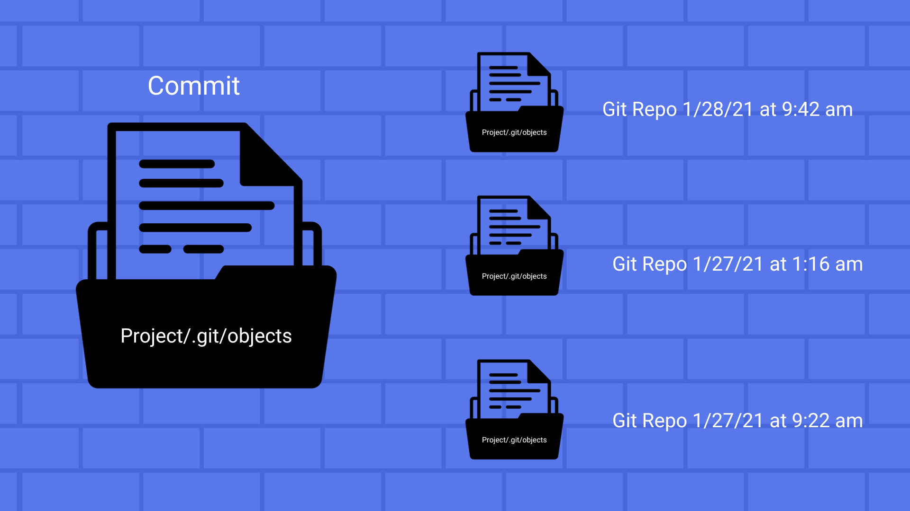

#Buổi 5: Dev thì không chỉ viết code
##I. Version control
###1. Định nghĩa
- **Version Control** là thực hành **theo dõi và quản lý các thay đổi** đối với mã phần mềm. Chúng đặc biệt hữu ích cho các nhóm DevOps vì chúng giúp họ giảm thời gian phát triển và tăng khả năng triển khai thành công.
- **Version control software** theo dõi mọi sửa đổi đối với mã trong một loại cơ sở dữ liệu đặc biệt. Nếu mắc lỗi, các thành viên trong nhóm so sánh các phiên bản mã trước đó để giúp khắc phục lỗi trong khi giảm thiểu sự gián đoạn trong dự án.
###2. Vì sao cần dùng Version Control
- Sử dụng **Version Control**: Kiểm soát phiên bản cũng giúp các nhà phát triển di chuyển nhanh hơn và cho phép các nhóm phần mềm **duy trì hiệu quả và sự nhanh nhẹn** khi nhóm mở rộng quy mô để bao gồm nhiều nhà phát triển hơn.
- **Lịch sử thay đổi lâu dài hoàn chỉnh của mọi tệp.** Có lịch sử đầy đủ cho phép quay lại các phiên bản trước để giúp phân tích nguyên nhân gốc rễ cho các lỗi và điều quan trọng là khi cần khắc phục sự cố trong các phiên bản phần mềm cũ hơn.
- **Phân nhánh và sáp nhập.** . Tạo một **"nhánh"** trong các công cụ VCS giữ cho nhiều luồng công việc **độc lập với nhau** đồng thời cung cấp cơ sở để **hợp nhất** công việc đó lại với nhau, cho phép các nhà phát triển xác minh rằng các thay đổi trên mỗi nhánh không xung đột.
- **Truy xuất nguồn gốc.** Theo dõi từng thay đổi được thực hiện đối với phần mềm và kết nối nó với phần mềm quản lý dự án. Có thể **chú thích từng thay đổi** bằng một thông điệp mô tả mục đích và ý định của thay đổi có thể giúp không chỉ với phân tích nguyên nhân gốc rễ. Có lịch sử chú thích của mã trong tầm tay bạn khi bạn đang đọc mã, **cố gắng hiểu nó đang làm gì và tại sao nó được thiết kế như vậy** có thể cho phép thực hiện các thay đổi chính xác và hài hòa phù hợp với thiết kế dài hạn dự định của hệ thống.
> **Link**: https://www.atlassian.com/git/tutorials/what-is-version-control
##II. Các khái niệm về Git
###1. Local Repository và Remote Repository
- Git có hai loại Repository: **Local**(Cục bộ) và **Remote**(từ xa). **Repo Local** chỉ có trên máy tính của bạn để sử dụng trực tiếp. **Repo Remote** thường ở nơi khác và để sử dụng gián tiếp của bạn. Git hỗ trợ nhiều Repo Remote.
####a. Remote Repository
- Thông thường, khi làm việc theo nhóm và cần làm việc với cơ sở mã nguồn cùng nhau. Cơ sở mã nguồn năm trên máy chủ trung tâm, mọi người **tải xuống file và commit nó.**
- Git đề cập đến **máy chủ tập trung như một Repo Remote**. Repo từ xa thường không có trên máy của bạn và là repo được nhóm chia sẻ. Nhóm "đẩy" Commit với nó khi sẵn sàng chia sẻ với nhóm. Mặc dù **một trong những repo từ xa của bạn có thể là repo cục bộ của một thành viên khác trong nhóm**, nhưng trong môi trường công ty, ít nhất một (hoặc duy nhất!) thường là repo Git trên máy chủ làm repo trung tâm / chính thức.
> **Lưu ý:** repo từ xa là tùy chọn. Khi không chia sẻ mã với người khác, về mặt kỹ thuật không cần repo từ xa
####b. Local Repository
- Repo local nằm trên máy tính của bạn và có tất cả các tệp và lịch sử cam kết của chúng, cho phép phân biệt đầy đủ, xem lại lịch sử và cam kết khi ngoại tuyến. 
<!-- -  -->
> Link: https://stackoverflow.com/questions/56296790/what-exactly-is-a-git-local-repository
###3. Branch
####a. Branch là gì?
- Branch là một bản sao của một project Git mà tại đó bạn có thể thay đổi bất cứ khi nào và sau đó kết hợp với project gốc. Các hoạt động trên mỗi branch sẽ không ảnh hưởng đến các branch khác nên có thể tiến hành nhiều thay đổi đồng thời trên một repository. Hơn nữa, bạn có thể dễ dàng hợp nhất branch đã tách vào một branch chính bằng các câu lệnh merge.
####b. Các hoạt động
- Branch chính, thường được gọi là branch “main”, là một branch mặc định chính thức.Dây là nơi chứa chính và mọi hoạt động của bạn sẽ được lưu trữ tại đây và không nên chỉnh sửa trực tiếp.

- Vì vậy, khi bạn muốn thực hiện các thay đổi, bạn phải tạo một branch mới từ branch chính, thực hiện các thay đổi trong đó và khi đã sẵn sàng, bạn sẽ yêu cầu hợp nhất các thay đổi của mình vào branch chính. 

> Link: https://vn.got-it.ai/blog/huong-dan-cach-tao-branch-trong-git
###4. Commit
####a. Commit là gì
- Git Commit là một lệnh cam kết trong Git, được dùng để **lưu lại những thay đổi trong repository** bằng các ảnh chụp nhanh (snapshot). Trước khi bắt đầu lệnh Git Commit, lệnh Git Add sẽ được chạy để thúc đẩy các thay đổi của dự án mà sau đó nó sẽ được lưu trữ trong một cam kết (commit).
- Commit là những bức ảnh chụp nhanh của dự án. Mọi commit đều được ghi lại trong nhánh chính của repository. Hai commit khác nhau sẽ **không bao giờ ghi đè** vì mỗi commit có ID riêng. ID của mỗi commit là một số mật mã được tạo bởi thuật toán SHA (Secure Hash Algorithm).
- 
####b. Các hoạt động
- Git Commit giống như một nền tảng xây dựng “điểm lưu” để kiểm soát phiên bản trong Git.  Các commit được coi là **các mốc quan trọng dọc theo dòng thời gian của một dự án Git**. Nó giúp nắm bắt trạng thái của một dự án tại thời điểm đó.

- Git Snapshots luôn được cam kết với Local repository. Git tạo cơ hội để **thu thập các cam kết trong Local repository** thay vì thực hiện cam kết ngay lập tức vào repository trung tâm. Nó giúp dễ dàng hơn trong việc chia một tính năng thành các commit, nhóm các commit liên quan với nhau và xóa lịch sử cục bộ trước khi xuất bản lên repository trung tâm. Nó cũng cho phép các lập trình viên có thể **làm việc một cách độc lập**.
- 
###5. Merge
####a. Merge là gì?
- Git Merge là một lệnh dùng để **hợp nhất các chi nhánh độc lập** thành một nhánh duy nhất trong Git.

- Khi sử dụng lệnh hợp nhất trong Git, chỉ có **nhánh hiện tại được cập nhật để phản ánh sự hợp nhất**, còn nhánh đích sẽ không bị ảnh hưởng. Git Merge thường được sử dụng kết hợp với git checkout để chọn nhánh hiện tại và git branch để xóa nhánh nguồn đã lỗi thời.

Git Merge là một lệnh hợp nhất các nhánh trong Git
####b. Các hoạt động
- Git Merge sẽ lấy hai nhánh và tìm thấy một commit cơ sở chung giữa chúng. Khi Git tìm thấy một commit cơ sở chung, nó sẽ tạo **một cam kết hợp nhất (merge commit) mới và hợp nhất các thay đổi theo trình tự của mỗi cam kết hợp nhất**. Ở đây, chúng ta có 2 nhánh: master branch và stage branch. Bây giờ, chúng ta sẽ hợp nhất stage branch vào master branch.

Mô hình hợp nhất stage branch vào master branch
- Các cam kết hợp nhất là duy nhất vì chúng có hai cam kết chính. Nó sẽ không kết hợp  “version control conflict” (xung đột kiểm soát phiên bản). Khi xảy ra xung đột, Git sẽ cần sự can thiệp của người dùng để tiếp tục.
 
Merge commit được tạo ra trong quá trình hợp nhất
> Link: https://short.com.vn/TVXW
###6. Pull
####a. Pull là gì?
- Git Pull là một lệnh dùng để **tải xuống dữ liệu** từ một Remote repository và cập nhật Local repository phù hợp với dữ liệu đó. Nói cách khác, Git Pull là lệnh hợp nhất các **thay đổi từ Remote repository vào Local repository.**
- Về bản chất, Git Pull chính là **sự kết hợp của 2 lệnh Git Fetch và Git Merge.**
####b. Cách hoạt động
-  Về cơ bản, Git Pull sẽ hoạt động theo một quy trình cơ bản dưới đây:
 -Thực hiện lệnh Git Fetch để tải xuống dữ liệu từ Remote repository được chỉ định.
 -Chạy lệnh Git Merge để hợp nhất các nội dung tham chiếu từ xa và hướng về một local merge commit mới.
 
####c. Phân biệt Pull và Fetch
- Trong Git, Git Pull và Git Fetch là 2 lệnh có chức năng tương đồng với nhau. Cả hai đều được sử dụng để tải xuống dữ liệu mới từ một Remote repository. Tuy nhiên, Git Fetch thường được coi là một phiên bản an toàn hơn của Git Pull.

- Git Fetch chỉ tải xuống nội dung từ Remote repository mà không **làm thay đổi trạng thái của Local repository**. Trong khi đó, Git Pull sẽ tải xuống nội dung và **cố gắng thay đổi trạng thái của Local repository** cho phù hợp với nội dung đó. Điều này có thể dẫn đến hiện tượng xung đột hợp nhất (merge-conflict) trong Git.
> Link: https://s.pro.vn/Jw6h
###7. Push
####a. Push là gì?
- Git push là một lệnh trong Git dùng để đẩy các commit mới từ máy trạm lên server. 
####b. Các bước thực hiện:
- Sử dụng lệnh git add để thêm file đã thay đổi hoặc file mới vào staging area.
- Sử dụng lệnh git commit để commit các file trong staging area.
- Sử dụng lệnh git push với cú pháp git push để đẩy các thay đổi lên remote.
###8. Clone
####a. Clone là gì?
- Clone là câu lệnh này cho phép các lập trình viên copy một Remote Repo về Local, ngoài ra có thể ứng dụng trong các trường hợp sau:
    + Copy một Repo từ máy Remote về Local
    + Copy một Repo từ thư mục này sang một thư mục khác
    + Copy một Repo từ một Url (https) ví dụ GitHub
####b. Ưu điểm
- Ưu điểm tuyệt vời của Git đó là khi bạn thực hiện Git Clone, bạn sẽ nhận được toàn bộ Repo, thay vì chỉ là 1 file như các hệ thống VCS khác. Đồng thời, bạn chỉ cần thực hiện Git Clone 1 lần duy nhất, đó là khi bắt đầu làm việc với dự án. Kể cả trong tương lai có phát triển thêm thì bạn cũng không cần clone lại một lần nữa.
> Link: https://vn.got-it.ai/blog/nhung-dieu-ban-chua-biet-ve-git-clone
###8. Fork
####a. Fork là gì?
- Một fork là một **bản copy của một repository** (Kho chứa source code của bạn trên Github). Việc fork một repository cho phép bạn dễ dàng chỉnh sửa, thay đổi source code mà **không ảnh hưởng tới source gốc.** 
####b. Ví dụ
- Khi bạn muốn fix bug source code trên repository của một ai đó, khi đó bạn cần thực hiện theo quy trình sau:
    + Fork repository đó về tài khoản Github của mình
    + Thực hiện fix bug
    + Gửi một Pull Request tới repository gốc
- Khi chủ sở hữu của repository nơi bạn fork, sẽ review chỉnh sửa của bạn, và tiến hành merge nội dung chỉnh sửa vào source gốc.
#III Pull Request
##1. Khi nào cần Pull Request
- **Pull Request** là một tính năng của hệ thống quản lý mã nguồn (source control management) như Git, GitHub, hay GitLab. Nó là một cách để người dùng có thể **đề xuất thay đổi vào mã nguồn của một dự án** đã được lưu trữ trên hệ thống quản lý mã nguồn đó.

- Khi một **người dùng muốn đóng góp vào một dự án**, họ có thể tạo một branch (nhánh) riêng từ branch chính (thường là branch master), thực hiện các thay đổi cần thiết trong branch này, rồi đưa các thay đổi lên remote repository và tạo một pull request.

- Khi một pull request được chấp nhận, các thay đổi được **hợp nhất vào branch chính của dự án.** Quá trình này có thể được tự động hóa bằng các công cụ tích hợp liên kết với hệ thống quản lý mã nguồn. Pull request là một cách linh hoạt và an toàn để đóng góp vào dự án và đảm bảo rằng các thay đổi mới không gây ra **tác động tiêu cực đến mã nguồn hiện có.**

<!-- ##2. Sự quan trọng
- **Đảm bảo chất lượng mã nguồn:** Pull Request giúp đảm bảo rằng tất cả các thay đổi trên mã nguồn đã được xem xét và kiểm tra kỹ lưỡng trước khi hợp nhất vào branch chính. 
- **Giúp đơn giản hóa quy trình kiểm tra code:** Pull Request cho phép người tham gia dự án có thể đóng góp thay đổi vào mã nguồn một cách dễ dàng.
- **Tăng tính minh bạch và sự tham gia của cộng đồng:** Pull Request cho phép cộng đồng tham gia vào quá trình phát triển, giúp tăng sự minh bạch và động lực cho các thành viên khác trong dự án.
- **Đóng góp vào phát triển dự án:** Pull Request cho phép các nhà phát triển đóng góp ý tưởng mới và thay đổi vào dự án một cách dễ dàng. 
 -->
##3. Cách tạo một Pull Request
- **Tạo một branch mới:** Đảm bảo rằng các thay đổi của bạn không ảnh hưởng đến mã nguồn chính của dự án.
**Chỉnh sửa mã nguồn:** Tiếp theo, bạn sẽ chỉnh sửa mã nguồn trên branch mới của mình.
**Commit thay đổi:** Sau khi bạn hoàn thành chỉnh sửa mã nguồn, bạn sẽ phải commit các thay đổi của mình vào branch mới của mình. Mỗi commit sẽ đại diện cho một bản sao của mã nguồn với các thay đổi mới của bạn.
**Tạo Pull Request:** Khi các thay đổi của bạn đã được commit vào branch mới, bạn có thể tạo Pull Request để gộp các thay đổi của mình vào nhánh chính của dự án. Trong quá trình tạo Pull Request, bạn sẽ cung cấp thông tin về các thay đổi của mình và mô tả về mục đích của các thay đổi đó.
**Xem xét và thảo luận:** Đưa ra các ý kiến, đề xuất sửa đổi hoặc chỉnh sửa thêm để tăng tính ổn định và hiệu quả của mã nguồn.
**Merge Pull Request:** Cuối cùng, sau khi các thay đổi đã được xem xét và chấp nhận, bạn có thể merge Pull Request vào nhánh chính của dự án.
#IV. UML
##1. UML là gì?
- **UML (Unified Modeling Language)** là một ngôn ngữ mô hình hóa thống nhẩt được sử dụng để biểu diễn và mô tả các khía cạnh khác nhau của một hệ thống hoặc phần mềm. 
- UML cung cấp một bộ các biểu đồ và biểu đồ mô tả có cấu trúc để hiển thị các phần khác nhau của hệ thống, bao gồm **kiến trúc, hành vi, quy trình làm việc, và tương tác giữa các thành phần.** Dựa trên nguyên tắc mô hình hóa, UML giúp đảm bảo rằng tất cả các bên liên quan đều có một cái **nhìn chung về cách hệ thống hoạt động,** từ đó tạo điều kiện thuận lợi cho việc phát triển và quản lý dự án.
<!-- ##2. Các loại biểu đồ phổ biến
- Dưới đây là 8 loại biểu đồ UML phổ biến:

  + **Biểu Đồ Lớp (Class Diagrams):** Được sử dụng để mô hình hóa cấu trúc của hệ thống, bao gồm các lớp, thuộc tính, và phương thức.
  + **Biểu Đồ Use Case (Use Case Diagrams):** Mô hình hóa các tương tác giữa hệ thống và người dùng hoặc hệ thống với các use case.
  + **Biểu Đồ Hoạt Động (Activity Diagrams):** Mô tả các hoạt động và luồng làm việc trong hệ thống.
  + **Biểu Đồ Chuỗi (Sequence Diagrams):** Biểu diễn các tương tác giữa các đối tượng trong thời gian thực.
  + **Biểu Đồ Trạng Thái (State Diagrams):** Mô hình hóa các trạng thái và chuyển đổi giữa chúng trong hệ thống.
  + **Biểu Đồ Giao Tiếp (Communication Diagrams):** Tương tự biểu đồ chuỗi, nhưng tập trung vào các tương tác giữa các đối tượng.
  + **Biểu Đồ Gói (Package Diagrams):** Mô tả cách các phần mềm phân chia thành các gói (packages) để dễ quản lý.
  + **Biểu Đồ Mô tả Giao Tiếp (Communication Overview Diagrams):** Mô hình hóa tương tác giữa các đối tượng và các tương tác bên trong hệ thống. -->
##3. Lý do cần vẽ UML
**- Hiểu rõ và Mô Hình Hóa Yêu Cầu**
+ Trước khi bắt đầu phát triển phần mềm, việc hiểu rõ yêu cầu là rất quan trọng. Bằng cách sử dụng các biểu đồ UML như Use Case Diagrams, bạn có thể mô tả cách hệ thống nên hoạt động và phản ứng trong các tình huống cụ thể.

**- Thiết Kế Cấu Trúc và Quan Hệ Phần Mềm**
- UML cung cấp các biểu đồ như Class Diagrams để thiết kế cấu trúc của phần mềm. Bạn có thể mô hình hóa các lớp, đối tượng và mối quan hệ giữa chúng để tạo ra một bản thiết kế cơ bản.

**- Tạo Tài Liệu Thiết Kế**
- UML cho phép bạn tạo ra tài liệu thiết kế quan trọng cho dự án. Các biểu đồ UML có thể được sử dụng để tạo tài liệu mô tả cấu trúc và hành vi của hệ thống, giúp cho việc triển khai dự án và giao tiếp với các bên liên quan.

**- Mô Phỏng và Kiểm Tra Hệ Thống**
- Trong quá trình phát triển, UML cung cấp khả năng mô phỏng các phần của hệ thống. Điều này giúp kiểm tra tính đúng đắn và hiệu suất của phần mềm trước khi triển khai nó vào môi trường thực tế.

**- Duy Trì và Nâng Cấp Phần Mềm**
- Một khi phần mềm đã được triển khai, UML vẫn đóng vai trò quan trọng trong việc duy trì và nâng cấp nó. Các biểu đồ UML có thể hỗ trợ trong việc hiểu cấu trúc hiện tại, nắm vững thay đổi cần thiết, và đảm bảo tính nhất quán trong quá trình phát triển tiếp theo.
> Link: https://hocjava.com/uml/
#V. Mô hình Class Diagram, Activity Diagram
##1. Class Diagram
###1.1 Định nghĩa
- **Class Diagram** là một loại biểu đồ trong kỹ thuật phần mềm, được sử dụng để mô tả cấu trúc và mối quan hệ giữa các lớp trong một hệ thống phần mềm. Nó là một phần quan trọng của mô hình hóa phân cấp, hay còn được gọi là UML (Unified Modeling Language), được sử dụng rộng rãi trong việc phát triển phần mềm. 
##1.2. Các thành phần cơ bản của Class Diagram 
- **Lớp (Class):** Lớp đại diện cho một đối tượng trong hệ thống phần mềm nhằm miêu tả thuộc tính và phương thức của đối tượng đó.
- **Thuộc tính (Attribute):** Thuộc tính là các đặc điểm/thông tin liên quan đến một lớp. Thuộc tính có thể là các biến, hằng số, hoặc các đối tượng khác.
- **Phương thức (Method):**  Phương thức là các hành động hoặc chức năng mà đối tượng có thể thực hiện. Chúng mô tả cách thức xử lý dữ liệu của lớp.
- **Quan hệ (Relationship):**  Quan hệ là đại diện cho mối liên kết hoặc tương tác giữa các lớp trong hệ thống
- **Đa số (Multiplicity):** Multiplicity chỉ ra số lượng đối tượng mà một quan hệ có thể có với đối tượng khác. Nó thể hiện bằng các ký hiệu số hoặc từ khóa.
- **Giao diện (Interface):** Giao diện xác định các phương thức mà một lớp hoặc một nhóm lớp phải triển khai.
<!--  

- Inheritance: 1 class kế thừa từ 1 class khác.
- Association: 2 class có liên hệ với nhau nhưng không chỉ rõ mối liên hệ.
- Composition: Đối tượng tạo từ lass A mất thì đối tượng tạo từ class B sẽ mất.
- Agreegation: Đối tượng tạo từ lass A mất thì đối tượng tạo từ class B vẫn tồn tại độc lập. -->
##2. Activity Diagram
###2.1 Định nghĩa
- Activity Diagram là bản vẽ tập trung vào mô tả các hoạt động, luồng xử lý bên trong hệ thống. Nó có thể được sử dụng để mô tả các qui trình nghiệp vụ trong hệ thống, các luồng của một chức năng hoặc các hoạt động của một đối tượng.
- Activity diagram là sơ đồ luồng xử lí của hệ thống, bao gồm luồng đi của dòng dữ liệu, dòng sự kiện. Mô tả các hoạt động trong một chức năng của hệ thống – luồng xử lý của một use case. 
###2.2 Các thành phần
1. Start
Kí hiệu:

Đặc điểm:

Khởi tạo một hoạt động.
Một activity diagram có thể có nhiều trạng thái Start.
2. Transition
Kí hiệu:

Đặc điểm: Mô tả sự chuyển đổi trạng thái của các hoạt động

3. Activity
Kí hiệu:

Đặc điểm:

Mô tả hành vi của đối tượng trong quy trình
Tên hoạt động phải ngắn gọn, đủ nghĩa. Nên đặt là động từ và mô tả đầy đủ ý nghĩa tổng thể của hoạt động nhất có thể.
4. Decision
Kí hiệu:

Đặc điểm: Đây là kí hiệu biểu thị nút điều kiện chuyển hướng. Tùy theo trường hợp đúng hay sai của kết quả mà có hướng di chuyển tiếp theo tương ứng.

Decision bao gồm hai loại sau: Branch và Merge

5. Branch
Kí hiệu:

Đặc điểm:

Mô tả điều kiện rẽ nhánh
Chỉ một dòng điều khiển đi vào
Hai hoặc nhiều dòng điều khiển đi ra
Chỉ một dòng điều khiển dẫn đến kết quả
Mỗi dòng chứa một điều kiện (guard), guard phải liên quan đến điều kiện và loại trừ nhau
6. Merge
Kí hiệu:

Đặc điểm:

Có hai hoặc nhiều dòng điều khiển đi vào
Chỉ một dòng điều khiển đi ra
7. Synchronization bar
Kí hiệu:

Đặc điểm:

Khi có các trường hợp cần hội tụ đủ nhiều luồng điều khiển một lúc để gộp thành một luồng xử lí thì cần dùng JOIN.
Khi cần phải tách một luồng điều khiển ra hai hoặc nhiều luồng khác biệt nhau thì cần dùng FORK. Mỗi luồng của FORK hoàn toàn không lệ thuộc nhau.
Synchronization bar bao gồm hai loại sau: Join và Fork

8. Join
Kí hiệu:

Đặc điểm:

Kết hợp các dòng điều khiển song song (FORK)
Có hai hoặc nhiều dòng điều khiển vào
Chỉ có một dòng điều khiển ra, dòng điều khiển ra được tạo khi tất cả các dòng cần thiết đã vào
9. Fork
Kí hiệu:

Đặc điểm:

Mô tả một dòng điều khiển được tách ra thực hiện song song
Chỉ có một dòng điều khiển đi vào
Có hai hoặc nhiều dòng điều khiển đi ra
Dùng FORK khi các hoạt động thực hiện không quan tâm thứ tự
10. End
Kí hiệu:

Đặc điểm:

Mô tả trạng thái kết thúc quy trình
Một activity diagram có thể có một hoặc nhiều trạng thái kết thúc