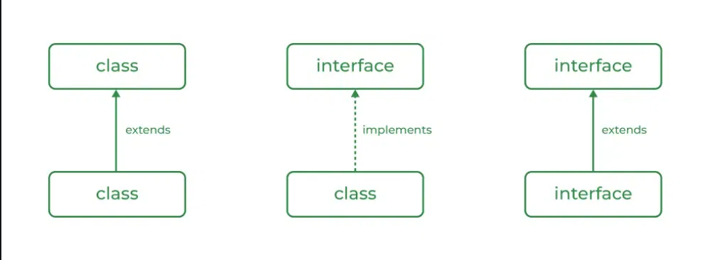
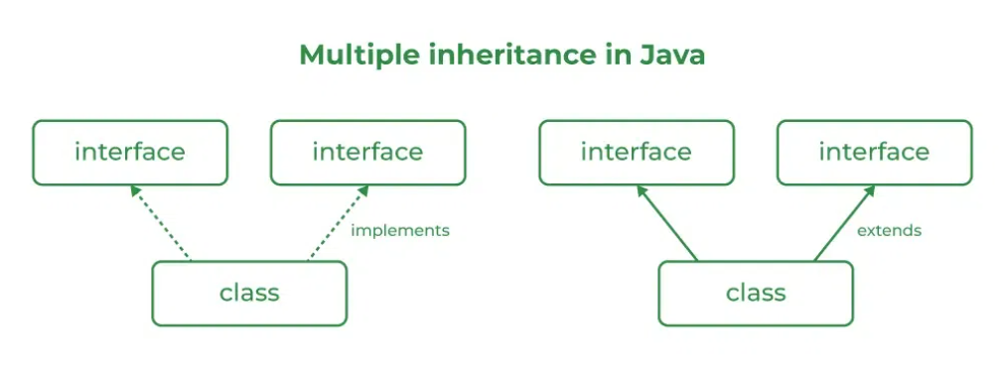
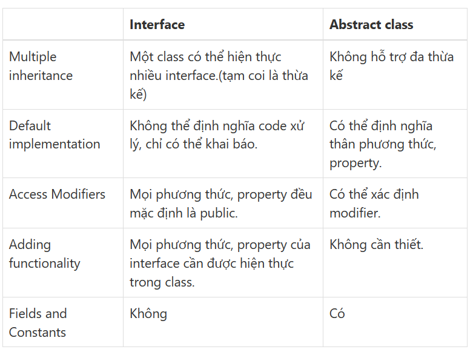

# INTERFACE VÀ TRỪU TƯỢNG
## I. Interface
- **Interface** là một kiểu trừu tượng được sử dụng để chỉ định hành vi của một lớp. **Interface** trong Java là một bản thiết kế của một hành vi. **Interface** Java chứa các trường public, static và final theo mặc định và các phương thức là public và abstract.
- Cú pháp cho interface
```
interface{
    \\ Các trường hằng số
    \\ Các phương thức trừu tượng
    \\ Các phương thức mặc định
}
```
- Sử dụng interface trong java
```
- Nó được sử dụng để đạt được sự trừu tượng tổng thể.
- Vì java không hỗ trợ nhiều kế thừa trong trường hợp của lớp, bằng cách sử dụng một giao diện, nó có thể đạt được nhiều kế thừa.
- Bất kỳ lớp nào cũng chỉ có thể mở rộng 1 lớp, nhưng bất kỳ lớp nào cũng có thể thực hiện vô số giao diện.
- Nó cũng được sử dụng để đạt được khớp nối lỏng lẻo.(Khi một đối tượng được sử dụng đối tượng từ các nguồn bên ngoài là khớp nối lỏng lẻo .)
=> https://vi.ichlese.at/everything-you-need-know-about-loose-coupling-java
- Giao diện được sử dụng để thực hiện trừu tượng.
```
- Sự khác biệt giữa interface và class
```
- Bạn không thể khởi tạo một interface.
- Một interface không chứa bất cứ hàm Contructor nào.
- Tất cả các phương thức của interface đều là abstract.
- Một interface không thể chứa một trường nào trừ các trường vừa static và final.
- Một interface không thể kế thừa từ lớp, nó được triển khai bởi một lớp.
- Một interface có thể kế thừa từ nhiều interface khác.
```
# **Đơn kế thừa**

- Ví dụ:
```java
interface Vehicle {
    void speedUp(int a);
}

class Bicycle implements Vehicle {
    int speed;
    @Override
    public void speedUp(int increment) {
        speed = speed + increment;
    }
    public void printStates() {
        System.out.println("speed: " + speed);
    }
}
class Bike implements Vehicle {
    int speed;
    @Override
    public void speedUp(int increment) {

        speed = speed + increment;
    }
    public void printStates() {
        System.out.println("speed: " + speed);
    }
}

public class Test{
    public static void main(String[] args) {
        Bicycle bicycle = new Bicycle();
        bicycle.speedUp(3);
        System.out.println("Bicycle speed:");
        bicycle.printStates();

        Bike bike = new Bike();
        bike.speedUp(4);
        System.out.println("Bike speed :");
        bike.printStates();
    }
}
```
# Đa kế thừa

- Ví dụ
```java
interface A {
    default void show()
    {
        System.out.println("A");
    }
}
interface B extends A {
    void display();
}
interface C extends A {
    void print();
}
 
class TestClass implements B, C {
    public void display()
    {
        System.out.println("B");
    }
    public void print()
    {
        System.out.println("C");
    }
    public static void main(String args[])
    {
        TestClass d = new TestClass();
 
        d.show();
        d.display(); 
        d.print(); 
    }
}
output: A
        B
        C
```
**Note:**  Tất cả các phương thức của interface cần được định nghĩa trong class. Tức là phần thân của phương thức của interface là rỗng
<!-- - Vì vậy, câu hỏi đặt ra là tại sao lại sử dụng giao diện khi chúng ta có các lớp trừu tượng?
=>  các biến trong giao diện là **final, public và static**. **Static** được sử dụng để xác định thành viên lớp có thể được sử dụng độc lập với bất kỳ đối tượng nào của lớp trong khi **final** được sử dụng để khai báo một biến hằng số hoặc một phương thức không thể bị ghi đè hoặc một lớp không thể được kế thừa.  -->
# II. Abstract Class
## 1.abstract class
- **Abstract** là một lớp không thể tự khởi tạo, nó cần được phân lớp bởi một lớp khác để sử dụng các thuộc tính của nó. **Abstract Class** được khai báo bằng cách sử dụng từ khóa "abstract" trong định nghĩa lớp của nó.
- Ví dụ
```java
abstract class Shape 
{
    int color;
    abstract void draw();
}
```

## 2. Các phần tử abstract class
- Thuộc tính
- Phương pháp trừu tượng và không trừu tượng
- Constructor
- Phương thức main().
- Ví dụ
```java
abstract class Subject {
    Subject() {
        System.out.println("Subject");
    }

    abstract void study();

    void Learn() {
        System.out.println("Learn!");
    }
}

class IT extends Subject {
    void study() {
        System.out.println("C , Java , C++");
    }
}

class GFG {
    public static void main(String[] args) {
        Subject x = new IT();

        x.study();
        x.Learn();
    }
}
```
## 3. Các tính chất
- Abstract class không thể được khởi tạo
```java
abstract class Subject {
    Subject() {
    }
}
class test {
    public static void main(String[] args) {
        Subject x = new Subject();
    }
}
=> Error
```
- Abstract class có thể chứa các constructor trong Java
```java
abstract class Subject {
    Subject() {
    }
}
class test {
    public static void main(String[] args) {
    }
}
```
- Abstract class có thể có các phương thức cuối cùng (các phương thức không thể ghi đè)
```java
abstract class A {
 
    final void fun()
    {
        System.out.println("A");
    }
}
class B extends A {
   
}
 
class Test {
 
    public static void main(String args[])
    {
        {
            A b = new B();
            b.fun();
        }
    }
}
```
- Có thể định nghĩa các static trong abstract class có thể được gọi độc lập mà không cần đối tượng.
```java
abstract class A {
    static void demofun()
    {
        System.out.println("A");
    }
}
 
public class GFG extends Helper {
    public static void main(String[] args)
    {
        A.demofun();
    }
}
```
- Chúng ta có thể sử dụng từ khóa abstract để khai báo các lớp cấp cao nhất (Lớp ngoài) cũng như các lớp bên trong là abstract
```java
abstract class B {
    abstract class C {
        abstract void sound();
    }
}
class D extends B {
    class E extends C {
        void sound()
        {
            System.out.println("A");
        }
    }
}
 
public class Main {
 
    public static void main(String args[])
    {
        D d = new D();
        D.E de = d.new E();
        de.sound();
    }
}
```
- Nếu một lớp chứa ít nhất một phương thức trừu tượng thì bắt buộc chúng ta phải khai báo lớp kế thừa là có phương thức đó
```java
abstract class Demo {
    abstract void m1();
}
 
class Child extends Demo {
    public void m1() 
    { 
      System.out.print("Hello"); 
    }
}
class Test {
    public static void main(String[] args)
    {
        Child c = new Child();
        c.m1();
    }
}
```
- Nếu lớp Child không thể thực hiện tất cả các phương thức trừu tượng của lớp Parent thì chúng ta nên khai báo lớp Child đó là trừu tượng để lớp con cấp độ tiếp theo sẽ cung cấp việc thực hiện cho phương thức trừu tượng còn lại
```java
abstract class Demo {
    abstract void m1();
    abstract void m2();
    abstract void m3();
}
 
abstract class FirstChild extends Demo {
    public void m1() {
      System.out.println("A"); 
    }
}
 
class SecondChild extends FirstChild {
    public void m2() {
      System.out.println("B"); 
    }
    public void m3() {
      System.out.println("C");
    }
}
 
class GFG {
    public static void main(String[] args)
    {
        SecondChild s = new SecondChild();
        s.m1();
        s.m2();
        s.m3();
    }
}
```
# III. Tính trừu tượng
## 1. Tính trừu tượng
- Quá trình mà chỉ hiển thị các chi tiết / chức năng cần thiết cho người dùng. Các chi tiết triển khai không cần thiết không được hiển thị cho người dùng.
```
Ví dụ đơn giản để hiểu trừu tượng:
Điều khiển từ xa truyền hình là một ví dụvề trừu tượng. Nó đơn giản hóa việc tương tác 
với TV bằng cách ẩn sự phức tạp đằng sau các nút và biểu tượng đơn giản, 
giúp bạn dễ dàng mà không cần phải hiểu các chi tiết kỹ thuật về cách thức hoạt động của TV.
```
- Ưu điểm của tính trừu tượng
```
- Tính trừu tượng cho phép các lập trình viên loại bỏ tính chất phức tạp của đối tượng bằng cách chỉ đưa ra các thuộc tính và phương thức cần thiết của đối tượng trong lập trình, cải thiện khả năng bảo trì của hệ thống.
- Tính trừu tượng giúp chúng ta tập trung vào những cốt lõi cần thiết của đối tượng thay vì quan tâm đến cách nó thực hiện.
- Tính trừu tượng cung cấp nhiều tính năng mở rộng khi sử dụng kết hợp với tính đa hình và kế thừa trong lập trình hướng đối tượng.
```
- Khi nào nên dùng abstract class và interface
=> Tạo một superclass chỉ định nghĩa một dạng khái quát hóa sẽ được chia sẻ bởi tất cả các lớp con của nó, để nó cho mỗi lớp con điền vào các chi tiết.

- Ví dụ
```java
abstract class Animal { 
    private String name; 
  
    public Animal(String name) { this.name = name; } 
  
    public abstract void makeSound(); 
  
    public String getName() { return name; } 
} 
  
class Dog extends Animal { 
    public Dog(String name) { super(name); } 
  
    public void makeSound() 
    { 
        System.out.println(getName() + " gau"); 
    } 
} 
  
class Cat extends Animal { 
    public Cat(String name) { super(name); } 
  
    public void makeSound() 
    { 
        System.out.println(getName() + " meo"); 
    } 
} 
  
public class AbstractionExample { 
    public static void main(String[] args) 
    { 
        Animal myDog = new Dog("Cho"); 
        Animal myCat = new Cat("Meo"); 
  
        myDog.makeSound(); 
        myCat.makeSound(); 
    } 
}
```
# IV. Cách dùng
- Sự khác nhau

- Khi một nhóm đối tượng có cùng bản chất kế thừa từ một class thì sử dụng **abstract class**. 
- Khi một nhóm đối tượng không có cùng bản chất nhưng chúng có hành động giống nhau thì sử dụng **interface**.