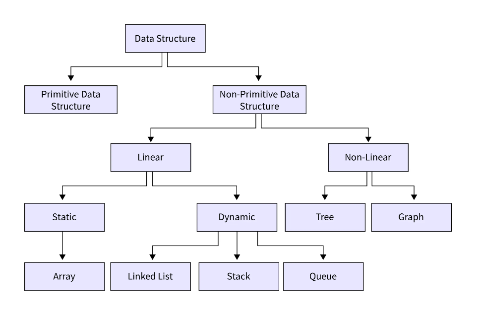
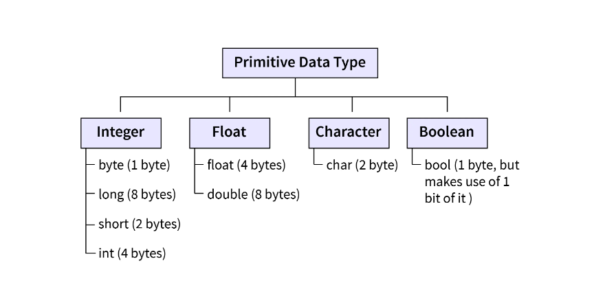
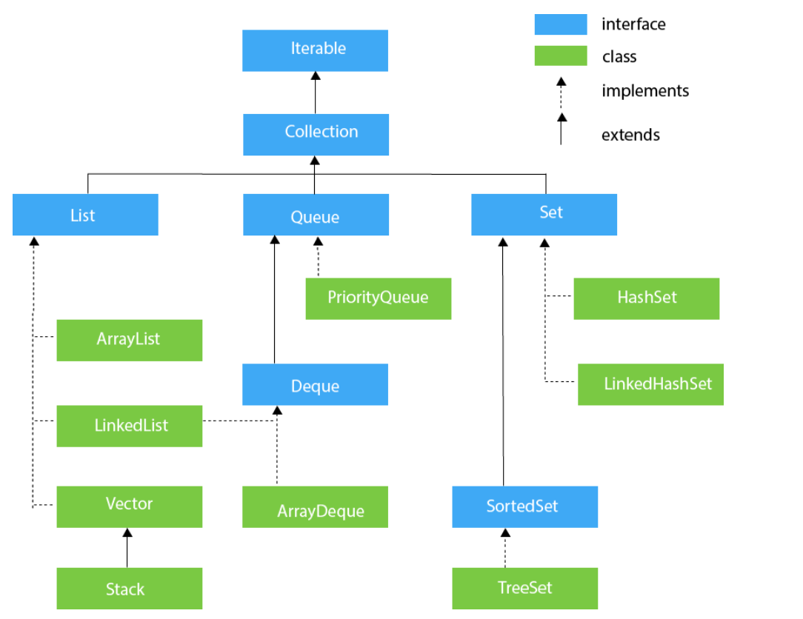
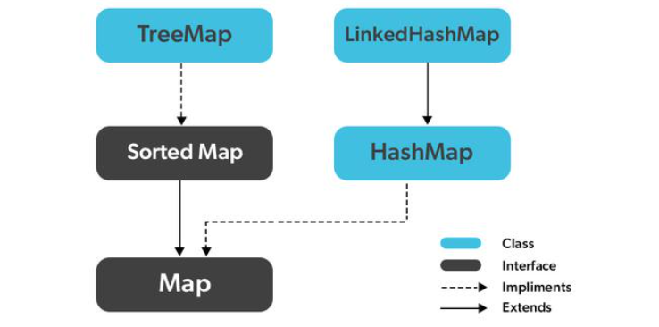

# MỘT SỐ CẤU TRÚC DỮ LIỆU THƯỜNG THẤY TRONG JAVA

## I. Cấu trúc dữ liệu
### 1. Định nghĩa
- Trong khoa học máy tính, **cấu trúc dữ liệu là một định dạng tổ chức, quản lý và lưu trữ dữ liệu.** Để cấu trúc dữ liệu thực tế, nó phải phù hợp với nhiệm vụ và dễ sử dụng. 
### 2. Các thành phần
- **Mối quan hệ:** Trong cấu trúc dữ liệu, các yếu tố có liên quan hoặc được kết nối theo một cách nào đó. 
- **Hoạt động:** Mỗi cấu trúc dữ liệu được liên kết với một tập hợp các chức năng có thể thực hiện và thao tác với nó.
- **Giá trị và kiểu dữ liệu:** Cấu trúc dữ liệu bao gồm các giá trị mà nó chứa và loại dữ liệu mà nó cho phép.
### 3. Các loại cấu trúc dữ liệu


#### 3.1 **Primitive Data Structures**

#### 3.2 **Non-primitive Data Structures**
- **Linear:** Cấu trúc dữ liệu trong đó các phần tử dữ liệu được sắp xếp tuần tự.
    + **Static:** Cấu trúc dữ liệu tĩnh có kích thước bộ nhớ cố định.
    + **Dynamic:** Cấu trúc dữ liệu tĩnh có kích thước bộ nhớ không cố định.
- **Non-linear:** Cấu trúc dữ liệu trong đó các phần tử dữ liệu được sắp xếp không tuần tự.
### 4. Sử dụng
- Quyết định về cấu trúc dữ liệu nào sẽ sử dụng thường dựa trên một số yếu tố. Trong nhiều trường hợp, không có một sự lựa chọn hoàn hảo.
  + Dung lượng lưu trữ
  + Yêu cầu về hiệu suất
  + Loại dữ liệu
  + Cách dữ liệu được sử dụng
  + Dễ sử dụng
  + Tính lâu dài
```
Nguồn: 
- https://www.geeksforgeeks.org/data-structures/
- https://www.javatpoint.com/data-structures-in-java
- https://www.linode.com/docs/guides/data-structure/
- https://www.scaler.com/topics/difference-between-primitive-and-non-primitive-data-structures/
```
# II. Interface iterable, collection
## 1. Interface iterable
- **Interface Iterable**  cho phép người dùng lặp qua các phần tử một cách tuần tự từ một bộ sưu tập. Nó trả về từng phần tử của bộ sưu tập lần lượt, bắt đầu từ phía trước, di chuyển theo hướng về phía trước. 
- **Interface Collection** kế thừa Interface Iterable, do đó, tất cả các lớp triển khai interface collection đều có thể lặp lại được.
## 2. Các cách interface iterable
- Phương thức iterator()
```java
import java.util.*;

public class Test {
    public static void main(String[] args) {
        Stack<Integer> stack = new Stack<>();
        for (int i = 0; i < 6; i++) {
            stack.push(i);
        }
        Iterator<Integer> iter;
        iter = stack.iterator();
        while (iter.hasNext()) {
            int nextElement = iter.next();
            System.out.print(nextElement + " ");
        }
    }
}
```
- Vòng lặp for nâng cao
```java
import java.util.*;

public class Test {
    public static void main(String[] args) {
        Stack<Integer> stack = new Stack<>();
        for (int i = 0; i < 6; i++) {
            stack.push(i);
        }
        for (int i:stack) 
            System.out.println(i);
    }
}
```
- Phương thức forEach()
**Syntax**
```java
Collection_name.forEach(
variable_name -> {// action to be performed with the elements;
});
```
**Ví dụ**
```java
import java.util.*;

public class Test {
    public static void main(String[] args) {
        Stack<Integer> stack = new Stack<>();
        for (int i = 0; i < 6; i++) {
            stack.push(i);
        }
        stack.forEach(i->System.out.println(i));
    }
}
```
```
Nguồn:https://www.scaler.com/topics/java/iterable-interface-in-java/
```
## 2. interface collection
- **Interface Collection** không được thực hiện trực tiếp bởi bất kỳ lớp nào. Tuy nhiên, nó được triển khai gián tiếp thông qua các kiểu con hoặc giao diện con của nó như **list, queue và set.**

## 2.1 List interface
- Cấu trúc dữ liệu kiểu danh sách trong đó chúng ta có thể lưu trữ bộ sưu tập các đối tượng theo thứ tự. Nó có thể có giá trị trùng lặp.
- Ví dụ
```java
import java.util.*;

public class Test {
    public static void main(String[] args) {
        List<Integer> stack = new Stack<>();
        stack.add(1);
        stack.add(2);
        stack.add(1);
        for(int x:stack) System.out.println(x);     
    }
}
output: 1
        2
        1
```
## 2.2 Queue Interface
- **Interface Queue** duy trì thứ tự nhập trước xuất trước(FIFO).
- Ví dụ:
```java
import java.util.*;

public class Test {
    public static void main(String[] args) {
        Queue<Integer> link = new LinkedList<>();
        link.add(1);
        link.add(2);
        link.add(3);
        for(int x:link) System.out.println(x);     
    }
}
```
## 2.3 Set
- Set đại diện cho tập hợp các phần tử không có thứ tự, không cho phép chúng ta lưu trữ các mục trùng lặp.
```java
import java.util.*;

public class Test {
    public static void main(String[] args) {
        Set<String> set = new HashSet<>();
        set.add("m");
        set.add("i");
        set.add("b");
        set.add("b");
        for (String x:set) System.out.println(x);
    }
}
```
```
Nguồn: https://www.javatpoint.com/collections-in-java
```

# III. Interface map, sorted map

## 1. Map
- Các phần tử của Map được lưu trữ trong các cặp key/ value. Key là các giá trị duy nhất được liên kết với các value riêng lẻ .
- Một map không thể chứa các key trùng lặp. Mỗi key được liên kết với một giá trị duy nhất.
## 2. Sorted map - Tree map
- **SortedMap trong Java** có thể được sắp xếp theo thứ tự tự nhiên của các key của nó hoặc bằng cách cung cấp một Comparator lúc tạo Map.
- Ví dụ
```java
import java.util.*; 
  
public class Test { 
  
    public static void main(String[] args) 
    { 
        SortedMap<String, Integer> map = new TreeMap<>(Collections.reverseOrder());

        map.put("b", 10); 
        map.put("a", 30); 
        map.put("c", 20); 

        for (Map.Entry<String, Integer> e : map.entrySet()) 
            System.out.println(e.getKey() + " "+ e.getValue()); 
    } 
}
output: c 20
    b 10
    a 30
```
## 3. HashMap
- Không duy trì các thứ tự khi truyền các phần từ vào
```java
import java.util.*; 
  
public class Test { 
  
    public static void main(String[] args) 
    { 
        Map<String, Integer> map = new HashMap<>();

        map.put("b", 10); 
        map.put("a", 30); 
        map.put("c", 20); 

        for (Map.Entry<String, Integer> e : map.entrySet()) 
            System.out.println(e.getKey() + " "+ e.getValue()); 
    } 
}
output: a 30
        b 10
        c 20
```
- Do bảng băm thì nó sẽ băm các giá trị nên các số gần nhau thì máy tính sắp xếp các giá trị gần nhau
=> thay bằng giá trị to để xem
# 4. Sort
## 4.1 Mảng
```java
import java.util.*; 
  
public class Test { 
  
    public static void main(String[] args) 
    { 
        int [] array = new int[]{1, 2, 4, 1, 3, 5, 7, 6};
        Arrays.sort(array);
        for (int x : array) {
            System.out.println(x);
        }
    } 
}
```
## 4.2 List
```java
import java.util.*; 
  
public class Test { 
  
    public static void main(String[] args) 
    { 
        List<Integer> list = new ArrayList<Integer>(Arrays.asList(1, 2, 4, 1, 3, 5, 7, 6));
        Collections.sort(list);
        for (Integer x:list) System.out.println(x);
    } 
}
```
## 4.3 Sắp xếp list objects sử dụng Comparator
- C1: implement interface Comparator<T>
```java
import java.util.ArrayList;
import java.util.Collections;
import java.util.Comparator;
import java.util.List;

public class Student implements Comparator<Student> {
    private int age;

    public Student(int age) {
        this.age = age;
    }

    public int getAge() {
        return age;
    }

    public int compare(Student o1, Student o2) {
        return o1.getAge() - o2.getAge();
    }

    public static void main(String[] args) {
        List<Student> list = new ArrayList<>();
        list.add(new Student(17));
        list.add(new Student(19));
        list.add(new Student(18));
        Collections.sort(list, new Student());
        for (Student student:list) System.out.println(student.getAge());
    }
}
```
- C2: Sử dụng anonymous comparator để so sánh
```java
import java.util.ArrayList;
import java.util.Collections;
import java.util.Comparator;
import java.util.List;

public class Student {
    private int age;

    public Student(int age) {
        this.age = age;
    }

    public int getAge() {
        return age;
    }

    public int compare(Student o1, Student o2) {
        return o1.getAge() - o2.getAge();
    }

    public static void main(String[] args) {
        List<Student> list = new ArrayList<>();
        list.add(new Student(17));
        list.add(new Student(19));
        list.add(new Student(18));
        Collections.sort(list, new Comparator<Student>() {
            public int compare(Student o1, Student o2) {
                return o1.getAge() - o2.getAge();
            }
        });
        for (Student student:list) System.out.println(student.getAge());
    }
}
```
## 4.4 Sắp xếp list objects sử dụng Comparable<T>
```java
import java.util.ArrayList;
import java.util.Collections;
import java.util.Comparator;
import java.util.List;

public class Student implements Comparable<Student>{
    private int age;

    public Student(int age) {
        this.age = age;
    }

    public int getAge() {
        return age;
    }

    public int compareTo(Student o) {
        return this.getAge() - o.getAge();
    }

    public static void main(String[] args) {
        List<Student> list = new ArrayList<>();
        list.add(new Student(17));
        list.add(new Student(19));
        list.add(new Student(18));
        Collections.sort(list);
        for (Student student:list) System.out.println(student.getAge());
    }
}

```