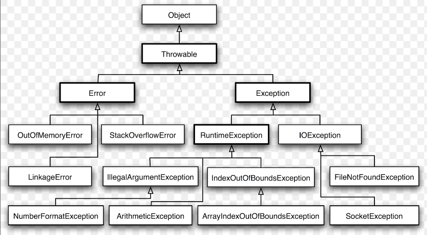

# Buổi 9: Luôn có ngoại lệ, xử lí ngoại lệ
## I. Làm quen với Exception: Checked và Unchecker Exception, Error
### 1. Định nghĩa, phân loại
-  **Exception** là một sự kiện chỉ xảy ra trong quá trình chương trình Java thực thi một câu lệnh nào đó và thông thường nó sẽ **phá vỡ luồng làm việc của chương trình**, tức là chương trình đang chạy sẽ **lập tức ngừng lại và xuất hiện thông báo lỗi.**
-  Ví dụ: Khi thực hiện phép chia một số nguyên dương cho số 0 thì khi biên dịch chương trình sẽ làm phát sinh lỗi và đó được coi là ngoại lệ.
```java
public class Test{
    public static void main(String[] args) {
        int a = 3, b = 0;
        int c = a/b;
        System.out.println(c);
    }
}
Exception in thread "main" java.lang.ArithmeticException: / by zero
        at Test.main(Test.java:4)
```
- **Nguyên nhân**
   + Đầu vào của người dùng không hợp lệ 
   + Lỗi thiết bị 
   + Mất kết nối mạng 
   + Giới hạn vật lý (hết bộ nhớ trên đĩa) 
   + Lỗi code 
   + Mở tệp không khả dụng
- **Các loại Exception**
   + **Checked Exception** là các Exception xảy ra tại **thời điểm Compile time** (là thời điểm chương trình đang được biên dịch). Những Exception này thường liên quan đến **lỗi cú pháp **(syntax) và bắt buộc chúng ta **phải "bắt" (catch) nó.**

    ```Java
    public class Test{
        public static void main(String[] args) {
            System.out.println(xyz);
        }
    }
    ```

    + **Unchecked Exception:** là các Exception xảy ra tại **thời điểm Runtime** (là thời điểm chương trình đang chạy). Những Exception này thường liên quan đến **lỗi logic** và **không bắt buộc chúng ta phải "bắt**" (catch) nó.
    ```java
    public class Test{
        public static void main(String[] args) {
            int a = 3, b = 0;
            int c = a/b;
            System.out.println(c);
        }
    }
    ```
    + **Error** thể hiện các tình trạng không thể khắc phục như **máy ảo Java (JVM) hết bộ nhớ, rò rỉ bộ nhớ, lỗi tràn ngăn xếp, không tương thích thư viện, đệ quy vô hạn, v.v**. Các lỗi thường nằm ngoài tầm kiểm soát của người lập trình và chúng ta không nên cố gắng xử lý lỗi.
    ```java
    public class Test{
        public static void Try(int i){
            Try(i+1);
        }
        public static void main(String[] args) {
            Try(0);
        }
    }
    ```
### 2. Một số exception thường gặp
- **Checked Exception**
    + **IOException:** Xuất hiện khi có lỗi nhập/xuất dữ liệu, ví dụ khi đọc/ghi file.
    + ClassNotFoundException: Xuất hiện trong quá trình complier, khi JVM không thể tìm thấy class được yêu cầu.

    + **SQLException:** Xuất hiện khi có lỗi trong quá trình truy vấn cơ sở dữ liệu

    + **InterruptedException:** Phát sinh khi một thread đang chờ, ngủ, hoặc bận rộn, và một thread khác đã làm gián đoạn nó.

    + **MalformedURLException:** Là một exception trong việc phân tích URL, nó sẽ kiểm tra URL có chính xác hay không.

    + **ParseException:** Xuất hiện khi có lỗi phân tích (parse) chuỗi sang một đối tượng, thường xuất hiện khi chuyển đổi chuỗi sang đối tượng Date hoặc số. 
- **Unchecked Exception**
    + **ArithmeticException:** Xảy ra khi có một phép toán không hợp lệ, ví dụ như chia một số cho zero.

    + **NullPointerException:** Xảy ra khi chương trình cố gắng truy cập hoặc sử dụng một đối tượng mà thực sự là null.

    + **ArrayIndexOutOfBoundsException:** Xảy ra khi chương trình cố gắng truy cập vào một chỉ số của mảng không tồn tại.

    + **ClassCastException:** Xảy ra khi chương trình cố gắng ép kiểu (cast) một đối tượng sang một kiểu không tương thích.

    + **NumberFormatException:** Xảy ra khi chương trình cố gắng chuyển đổi một chuỗi không phải là số sang một kiểu số (ví dụ: Integer.parseInt("abc")).

    + **IllegalStateException:** Xảy ra khi một đối tượng không ở trong trạng thái thích hợp để thực hiện một hoạt động nào đó.

## II. Bắt Exception với try-catch
### 1. Định nghĩa
- **try:** Khối try chứa đoạn mã có thể gặp lỗi hoặc ném ra ngoại lệ khi thực thi. Nếu có bất kỳ ngoại lệ nào xảy ra trong khối try, chương trình sẽ chuyển quyền kiểm soát đến khối catch tương ứng.
> Mỗi khối try phải theo sau ít nhất một khối catch hoặc một khối finally.
- **catch:** Khối catch chứa đoạn mã sẽ được thực thi nếu có ngoại lệ xảy ra trong khối try tương ứng. Khối catch chủ yếu được sử dụng để xử lý ngoại lệ hoặc ghi log về lỗi.
> Có thể có nhiều khối catch sau một khối try, mỗi khối catch xử lý một loại ngoại lệ cụ thể.
### 2. Cú pháp
```java
Try(){
    //Khối lệnh
}Catch(NameException NameVariable){
    //Khối lệnh
}
```
- Ví dụ:
```java
class Test {
    public static void main(String[] args)
    {
        int a = 10, b = 5, c = 5, result;
        try {
            result = a / (b - c);
            System.out.println(result);
        }
        catch (ArithmeticException Minh) {
            System.out.println("Division by zero");
        }
    }
}
```
> Tùy vào mục đích sử dụng để sử dụng Exception cho phù hợp
## III. Finally
- Trong xử lý ngoại lệ của Java, từ khoá finally được sử dụng để tạo một khối mã mà sẽ được thực thi sau khi thực hiện xong khối try và khối catch, không phụ thuộc vào việc có ngoại lệ xảy ra hay không. Điều này đảm bảo rằng **mã trong khối finally luôn luôn được thực thi.**
- Thường dùng dọn dẹp tài nguyên (đóng file sau khi mở, đóng kết nối cơ sở dữ liệu) hay bên trên có câu lệnh return.
- Finally không thực hiện khi chương trình lỗi hoặc có câu lệnh System.exit(0);
- Ví dụ
```java
class Test {
    public static void main(String[] args)
    {
        int a = 10, b = 5, c = 5, result;
        try {
            result = a / (b - c);
            System.out.println(result);
        }
 
        catch (ArithmeticException Minh) {
            System.out.println("Division by zero");
            // return;
            // System.exit(0);
        }
        finally{
            System.out.println("Exceptions");
        }
    }
}
```
> Finally là thành phần optional, nó không nhất thiết phải được sử dụng trong toàn bộ quá trình exception handling nếu không cần thiết.
## IV. Cây phân cấp Exception, phân biệt throw và throws
### 1. Cây phân cấp

### 2. Phân biệt throw và throws
#### 2.1 throw
- Từ khoá throw trong java được sử dụng để ném ra một ngoại lệ cụ thể.
- Chúng ta có thể ném một trong hai ngoại lệ checked hoặc unchecked trong java bằng từ khóa throw. Từ khóa throw chủ yếu được sử dụng để **ném ngoại lệ tùy chỉnh** (ngoại lệ do người dùng tự định nghĩa).
- Ví dụ:
```java
class Test {
    public static void len(String s){
        if (s==null){
            throw new NullPointerException("Chuoi null");
        }
        System.out.println(s.length());
    }
    public static void main(String[] args)
    {
        String s = null;
        len(s);
    }
}
```
#### 2.2 Throws
- Throws được sử dụng để khai báo các exception có thể ném ra bởi method. Nơi gọi method này phải xử lý các exception bằng try-catch hoặc sử dụng lại từ khoá throws để ném lên cho method ở trên xử lý. 
- Nếu một method khai báo các exception có thể ném với từ khoá throws thì các method sử dụng chúng sẽ bắt buộc phải xử lý nếu không sẽ bị trình biên dịch báo unreported
- Ví dụ:
```java
class Test {
    public static void a() throws ArithmeticException{
        b();
    }
    public static void b() throws ArithmeticException{
        System.out.println(3/0);
    }
    public static void main(String[] args)
    {
        try {
            a();
        } catch (ArithmeticException e) {
            System.out.println("ex");
        }
    }
}
```
#### 2.3 Phân biệt
- Throw
    + Từ khóa throw trong java được sử dụng để ném ra một ngoại lệ rõ ràng.	
	+ Ngoại lệ checked không được truyền ra nếu chỉ sử dụng từ khóa throw.
	+ Sau throw là một instance.	
	+ Throw được sử dụng trong phương thức.	
	+ Bạn không thể throw nhiều exceptions.
- Throws 
    + Từ khóa throws trong java được sử dụng để khai báo một ngoại lệ.
    + Ngoại lệ checked được truyền ra ngay cả khi chỉ sử dụng từ khóa throws.
    + Sau throws là một hoặc nhiều class.
    + Throws được khai báo ngay sau dấu đóng ngoặc đơn của phương thức.
    + Bạn có thể khai báo nhiều exceptions
## V. Tạo Exception
- Ngoại lệ riêng của mình được biết đến như ngoại lệ tùy chỉnh (exception tùy chỉnh) hoặc ngoại lệ do người dùng định nghĩa. Các ngoại lệ tùy chỉnh trong Java được sử dụng để tùy chỉnh ngoại lệ theo nhu cầu của người dùng.

- Ví dụ
```java
class InvalidException extends Exception {
}
public class Test {
    public static void check(int cao) throws InvalidException{
        if (cao<170) throw new  InvalidException();
        else System.out.println("Dau");
    }
    public static void main(String[] args)
    {
        try {
            check(165);
        } catch (InvalidException e) {
            System.out.println("Truot");
        }
    }
}
```