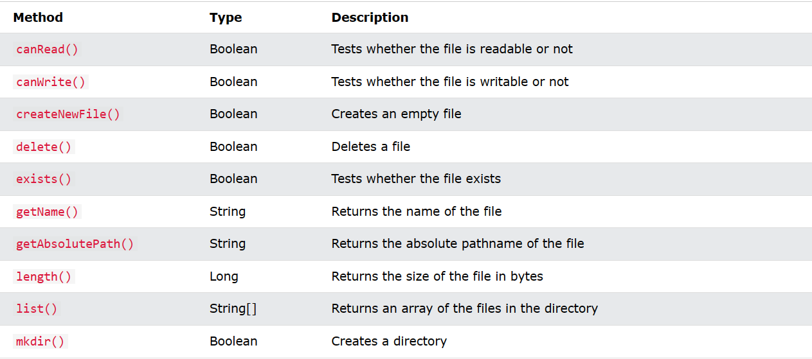
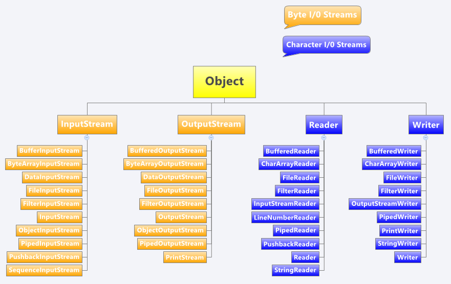

# NHẬP XUẤT FILE, UNIT TEST

## I. Xử lí File trong Java (Binary file, Text file)

### 1. File
- Lớp trong gói java.io.File, cho phép chúng ta làm việc với files.
- Để sử dụng lớp, hãy tạo một đối tượng của lớp và chỉ định tên tệp hoặc tên thư mục: File
- Ví dụ:
```java
import java.io.File; 
File myObj = new File("filename.txt");
```
- Các phương thức trong file

- Ví dụ:
```java
import java.io.File;

public class test { 
    public static void main(String[] args){ 
        File obj = new File("filename.txt");
        if (obj.canRead()){
          System.out.println("Can read");
        }
        else{
          System.out.println("Cannot read");
        }
    } 
} 
> output: cannot read
```
### 2. Byte Streams và Character Streams


#### 2.1 Byte Streams
- **Định nghĩa:** Byte stream là một dòng dữ liệu được xử lý từng byte tại một thời điểm. Dữ liệu trong byte stream được xem xét dưới dạng chuỗi các byte, không quan tâm đến kí tự hay ngôn ngữ.
- **Sử dụng:** Byte stream thường được sử dụng khi làm việc với dữ liệu nhị phân, như hình ảnh, âm thanh, hoặc dữ liệu không dựa trên ngôn ngữ như file nhị phân.
- Ví dụ
```java
import java.io.FileInputStream;
import java.io.FileOutputStream;
import java.io.IOException;

public class test {
    public static void main(String[] args) {
        try (FileOutputStream outputStream = new FileOutputStream("byteData.txt")) {
            String data = "Hello, Byte Stream!";
            byte[] byteData = data.getBytes();
            outputStream.write(byteData);
            System.out.println("Successful.");
        } catch (IOException e) {
            e.printStackTrace();
        }

        try (FileInputStream inputStream = new FileInputStream("byteData.txt")) {
            int data;
            while ((data = inputStream.read()) != -1) {
                System.out.print((char) data);
            }
        } catch (IOException e) {
            e.printStackTrace();
        }
    }
}
```
#### 2.2 Character Stream (Dòng Kí tự):

- **Định nghĩa:** Character stream là một dòng dữ liệu được xử lý từng kí tự tại một thời điểm. Dữ liệu trong character stream được xem xét dưới dạng chuỗi các kí tự, thường theo các bộ mã kí tự như UTF-8, UTF-16, v.v.
- **Sử dụng:** Character stream thường được sử dụng khi làm việc với văn bản hoặc dữ liệu có liên quan đến ngôn ngữ, nơi mà quyết định về mã hóa kí tự và các vấn đề liên quan đến ngôn ngữ là quan trọng.
- Ví dụ:
```java
import java.io.FileReader;
import java.io.FileWriter;
import java.io.IOException;

public class test {
    public static void main(String[] args) {
        try (FileWriter writer = new FileWriter("charData.txt")) {
            String data = "Hello, Character Stream!";
            writer.write(data);
            System.out.println("sucessful.");
        } catch (IOException e) {
            e.printStackTrace();
        }

        try (FileReader reader = new FileReader("charData.txt")) {
            int data;
            while ((data = reader.read()) != -1) {
                System.out.print((char) data);
            }
        } catch (IOException e) {
            e.printStackTrace();
        }
    }
}
```
### 3. Binary file và Text file
#### 3.1 Binary file
- Tệp nhị phân lưu trữ dữ liệu ở định dạng **không thể đọc** trực tiếp của chúng ta. Chúng bao gồm các chuỗi byte đại diện cho nhiều loại dữ liệu khác nhau, **chẳng hạn như hình ảnh, âm thanh, video hoặc các chương trình được biên dịch.**
- Chúng ta không thể dễ dàng hiểu các tệp nhị phân, vì chúng yêu cầu phần mềm hoặc ứng dụng cụ thể để diễn giải nội dung của chúng một cách chính xác. Trong Java, các tệp nhị phân được sử dụng cho các hoạt động liên quan đến **dữ liệu thô hoặc thông tin phi văn bản, như xử lý hình ảnh hoặc nén tệp.**
- **Ưu điểm:**
  - Hiệu quả hơn trong việc lưu trữ dữ liệu phức tạp, như hình ảnh, âm thanh, video, v.v.
  - Xử lý nhanh hơn vì không cần chuyển đổi dữ liệu.
- **Nhược điểm:**
  - Không dễ đọc hoặc hiểu cho con người.
  - Dễ bị hỏng nếu có lỗi nhỏ.
#### 3.2 Text file
- Tệp văn bản là tệp lưu trữ dữ liệu ở định dạng **văn bản thuần túy.** Chúng chứa các ký tự mà con người **có thể đọc được**, chẳng hạn như chữ cái, số, ký hiệu và khoảng trắng.

- Các tệp văn bản có thể được mở và đọc bằng trình soạn thảo văn bản đơn giản và nội dung của chúng **có thể dễ dàng hiểu** được bởi con người. Trong Java, các tệp văn bản thường được sử dụng để lưu trữ dữ liệu **cấu hình, nhật ký và thông tin văn bản khác.**
- **Ưu điểm**
  - Đơn giản, dễ đọc và dễ hiểu cho con người.
  - Dễ di chuyển giữa các hệ thống vì không chứa thông tin tùy chỉnh.
  - Không dễ bị hỏng.
- **Nhược điểm:**
  - Chỉ chứa dữ liệu văn bản, không thể lưu trữ dữ liệu phức tạp.
  - Không hiệu quả cho việc lưu trữ dữ liệu nhị phân.

## II.Assertions
### 1. Định nghĩa
- Một **Assertions** cho phép kiểm tra tính đúng đắn của bất kỳ giả định nào đã được đưa ra trong chương trình. Một **Assertions** đạt được bằng cách sử dụng câu lệnh assert trong Java. Nó chủ yếu được sử dụng cho mục đích **thử nghiệm trong quá trình phát triển.**
### 2. Cú pháp
- Câu lệnh assert được sử dụng với biểu thức Boolean và có thể được viết theo hai cách khác nhau.
> Cách 1: assert expression;
> Cách 2: assert expression1 : expression2;
- Ví dụ:
```java
class Test {
    public static void main(String args[])
    {
        int value = 25;
        assert value <= 20 : "Gay";
        System.out.println("value is " + value);
    }
}
```
### 3. Kích hoạt
#### 3.1 Kích hoạt khẳng định  
- Theo mặc định, xác nhận bị tắt. Chúng ta cần chạy code như đã cho. Cú pháp để kích hoạt câu lệnh khẳng định trong mã nguồn Java là:
> Cách 1: java –ea NameFile

> Cách 2: java –enableassertions NameFile

#### 3.2 Vô hiệu hóa khẳng định
- Cú pháp để vô hiệu hóa các khẳng định trong java là:
> Cách 1: java –da NameFile

> Cách 2: java –disableassertions NameFile

#### 4. Nơi sử dụng
- **Nơi sử dụng Assertions** 
  - Lập luận cho các phương pháp riêng tư. Các đối số riêng tư chỉ được cung cấp bởi mã của nhà phát triển và nhà phát triển - có thể muốn kiểm tra các giả định của mình về các đối số.
  - Các trường hợp có điều kiện.
  - Điều kiện khi bắt đầu bất kỳ phương pháp nào.
- **Nơi không sử dụng Assertions**  

  - Không nên sử dụng xác nhận để thay thế thông báo lỗi
  - Không nên sử dụng khẳng định để kiểm tra các đối số trong các phương thức công khai vì chúng có thể được cung cấp bởi người dùng. Xử lý lỗi nên được sử dụng để xử lý các lỗi do người dùng cung cấp.
  - Khẳng định không nên được sử dụng trên các đối số dòng lệnh.
## III. Unit Test
### 1. Định nghĩa
- **Unit Test** là một loại kiểm thử phần mềm trong đó các đơn vị hay thành phần riêng lẻ của phần mềm được kiểm thử. Kiểm thử đơn vị được thực hiện trong quá trình phát triển ứng dụng. Mục tiêu của Kiểm thử đơn vị là **cô lập một phần code và xác minh tính chính xác của đơn vị đó.**
- **Một Unit** là một thành phần PM nhỏ nhất mà ta có thể kiểm tra được như **các hàm (Function), thủ tục (Procedure), lớp (Class), hoặc các phương thức (Method).**
### 2. Vòng đời
- **Gồm 3 trạng thái cơ bản**
  - Fail (trạng thái lỗi)
  - Ignore (tạm ngừng thực hiện)
  - Pass (trạng thái làm việc)
- **UT chỉ thực sự đem lại hiệu quả khi:**
  - Được vận hành lặp lại nhiều lần
  - Tự động hoàn toàn
  - Độc lập với các UT khác.
### 3. Thiết kế
- Mỗi UT đều được tiết kế theo trình tự sau:

  - Thiết lập các điều kiện cần thiết: khởi tạo các đối tượng, xác định tài nguyên cần thiết, xây dựng các dữ liệu giả…
  - Triệu gọi các phương thức cần kiểm tra.
  - Kiểm tra sự hoạt động đúng đắn của các phương thức.
  - Dọn dẹp tài nguyên sau khi kết thúc kiểm tra.
#### IV. Tầm quan trọng của unit test
- Tạo ra môi trường lý tưởng để kiểm tra bất kỳ đoạn code nào, có khả năng thăm dò và phát hiện lỗi chính xác, duy trì sự ổn định của toàn bộ PM và giúp tiết kiệm thời gian so với công việc gỡ rối truyền thống.
- Phát hiện các thuật toán thực thi không hiệu quả, các thủ tục chạy vượt quá giới hạn thời gian.
- Phát hiện các vấn đề về thiết kế, xử lý hệ thống, thậm chí các mô hình thiết kế.
- Phát hiện các lỗi nghiêm trọng có thể xảy ra trong những tình huống rất hẹp.
- Tạo hàng rào an toàn cho các khối mã: Bất kỳ sự thay đổi nào cũng có thể tác động đến hàng rào này và thông báo những nguy hiểm tiềm tàng.