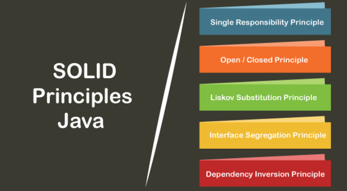

# BUỔI 11: CÁC NGUYÊN TẮC THIẾT KẾ, MÔ HÌNH THIẾT KẾ
## I. SOLID
- Các nguyên tắc SOLID được Robert C. Martin giới thiệu trong bài báo "Nguyên tắc thiết kế và mẫu thiết kế" năm 2000 của ông. Và trong 20 năm qua, năm nguyên tắc này đã **cách mạng hóa thế giới lập trình hướng đối tượng**, thay đổi cách chúng ta viết phần mềm.
- **SOLID có 5 nguyên tắc bao gồm:**
    - **Single Responsibility Principle(SRP)**: Quy tắc trách nhiệm đơn lẻ
    - **Open-Closed Principle (OCP)**: Quy tắc mở đóng
    - **Liskov Substitution Principle (LSP)**: Quy tắc thay thế
    - **Interface Segregation Principle (ISP)**: Quy tắc phân chia giao diện
    - **Dependency Inversion Principle (DIP)**: Quy tắc đảo ngược phụ thuộc



### 1. Single Responsibility Principle(Quy tắc trách nhiệm đơn lẻ)
#### 1.1 Khái quát
- Nguyên tắc trách nhiệm đơn lẻ nêu rõ rằng **mọi lớp Java phải thực hiện một chức năng duy nhất.** Việc triển khai nhiều chức năng trong một lớp duy nhất sẽ kết hợp mã và nếu có bất kỳ sửa đổi nào được yêu cầu có thể ảnh hưởng đến cả lớp. **Nó có mã chính xác và mã có thể được bảo trì dễ dàng**. 

- Ví dụ: **Student** là một lớp có ba phương thức là **printDetails()**, **CalculateGPA()** và **addStudent()**. Do đó, lớp **Student** có ba trách nhiệm trên. Bằng cách sử dụng nguyên tắc trách nhiệm đơn lẻ, chúng ta có thể tách các chức năng này **thành ba lớp riêng biệt để hoàn thành mục tiêu của nguyên tắc.**
#### 1.2 Ví dụ
```java
Student.java

public class Student  {  
    public void printDetails(){ 

    }  
    pubic void calculatePercentage(){ 

    }  
    public void addStudent(){  

    }  
} 
```
- Đoạn Code trên **vi phạm nguyên tắc trách nhiệm đơn lẻ.** Để đạt được mục tiêu của nguyên tắc, chúng ta nên triển khai **một lớp riêng biệt chỉ thực hiện một chức năng duy nhất.**
```java
Student.java

public class Student  {  
    public void addStudent(){

    }  
}  
```
```java
PrintStudentDetails.java

public class PrintStudentDetails{  
    public void printDetails(){  
 
    }  
}  
```
```java
Percentage.java

public class Percentage{  
    public void calculatePercentage(){  

    }  
}  
```
> Do đó, chúng ta đã đạt được mục tiêu của nguyên tắc trách nhiệm đơn lẻ bằng cách tách chức năng thành ba lớp riêng biệt.
### 2. Open-Closed Principle(Quy tắc mở đóng)
#### 2.1 Khái quát
- Theo nguyên lý này, mỗi khi ta muốn thêm chức năng cho chương trình, chúng ta **nên viết class mới mở rộng class cũ (bằng cách kế thừa hoặc sở hữu class cũ) chứ không nên sửa đổi class cũ.** Việc này dẫn đến tình trạng phát sinh nhiều class, nhưng chúng ta sẽ **không cần phải test lại các class cũ nữa**, **mà chỉ tập trung vào test các class mới, nơi chứa các chức năng mới.**
- Cách giải quyết là tách những phần dễ thay đổi ra khỏi phần khó thay đổi mà vẫn đảm bảo không ảnh hưởng đến phần còn lại.
#### 2.2 Ví dụ
- Giả sử Vehicle là một lớp và nó có phương thức VehicleNumber() trả về số xe.
```java
Vehicle.java

public class Vehicle   
{  
    public double vehicleNumber(){  
  
    }  
}  
public class Car extends Vehicle   
{  
    public double vehicleNumber()   
    {  
        return this.getValue();  
    }  
}
```
- Nếu chúng ta muốn thêm lấy biển số của lớp Truck, chỉ cần thêm một câu lệnh if, nhưng **vi phạm nguyên tắc đóng mở.** Cách duy nhất để thêm lớp con và đạt được mục tiêu nguyên tắc là **ghi đè phương thức VehicleNumber().**
```java
Vehicle.java

public class Vehicle   
{  
    public double vehicleNumber(){  
  
    }  
}  
public class Car extends Vehicle   
{  
    public double vehicleNumber()   
    {  
        return this.getValue();  
    }  
}
public class Car extends Truck   
{  
    public double vehicleNumber()   
    {  
        return this.getValue();  
    }
}  
```
- Tương tự, chúng ta có thể thêm nhiều phương tiện hơn bằng cách tạo một lớp con khác mở rộng từ lớp phương tiện đó. **Cách tiếp cận sẽ không ảnh hưởng đến ứng dụng hiện có.**
### 3. Liskov Substitution Principle(Quy tắc thay thế)
#### 3.1 Khái quát
- **Nguyên tắc thay thế Liskov (LSP)** được giới thiệu bởi Barbara Liskov. Nó áp dụng cho sự kế thừa theo cách mà các **lớp dẫn xuất phải hoàn toàn thay thế được cho các lớp cơ sở của chúng.** Nói cách khác, nếu lớp A là kiểu con của lớp B thì chúng ta có thể thay thế B bằng A mà **không làm gián đoạn hoạt động của chương trình.**
- Nó **mở rộng nguyên tắc đóng mở và cũng tập trung vào hành vi của siêu lớp và các kiểu con của nó.** Chúng ta nên thiết **kế các lớp để bảo toàn thuộc tính** trừ khi chúng ta có lý do chính đáng để làm khác.
#### 3.2 Ví dụ
```java
Student.java
public class Student   
{  
    private double height;  
    private double weight;  
    public void setHeight(double h)   
    {   
        height = h;   
    }  
    public void setWeight(double w)   
    {   
        weight= w;   
    }  
  
}  
public class StudentBMI extends Student  
{  
    public void setHeight(double h)   
    {  
        super.setHeight(h);  
        super.setWeight(h);  
    }  
    public void setWeight(double w)   
    {  
        super.setHeight(w);  
        super.setWeight(w);  
    }  
}  
```
- Các lớp trên **đã vi phạm nguyên tắc thay thế Liskov** vì lớp StudentBMI có thêm các ràng buộc, tức là chiều cao và cân nặng phải giống nhau. Vì vậy, **lớp Student (lớp cơ sở) không thể thay thế bằng lớp StudentBMI (lớp dẫn xuất)**.
## II. KISS, DRY, YAGDI
### 1. KISS
- **KISS = Keep It Simple Stupid**
- Tóm lại, hàm ý của nó vẫn hướng về một **sự đơn giản và rõ ràng trong mọi vấn đề.** Và như vậy, sự đơn giản là mục đích trọng tâm trong thiết kế, còn những cái phức tạp không cần thiết thì nên tránh.

- Trong lập trình, KISS nghĩa là hãy **làm cho mọi thứ (mã lệnh của bạn) trở nên đơn giản và dễ nhìn hơn**. Hãy chia nhỏ vấn đề và giải quyết từng cái. Hãy để số lượng dòng code của một lớp hay phương thức ở con số hàng chục thôi.
### 2. DRY
- **DRY = Don’t Repeat Yourself**
- Nguyên tắc này có nghĩa là **đừng có viết lặp bất kỳ lại một đoạn mã nào mà hãy đóng gói nó thành phương thức riêng**. Đến khi cần thì chỉ cần gọi tên nó ra.

- Nguyên tắc này nó giống như tính chất kế thừa trong lập trình hướng đối tượng OOP.
### 3. YAGNI:
- **YAGNI = You Aren’t Gonna Need It**

- Nguyên tắc này là dự án của bạn đang làm thì **chỉ cần tập trung xây dựng chức năng quyết vấn đề ở thời điểm hiện tại**, vấn đề mà khách hàng cần giải quyết, **không cần lãng phí thời gian vào một chức năng "Có thể sử dụng đến".**

>  Đừng tự vẽ việc cho mình.

## III. MVC
- MVC là viết tắt của Model-View-Controller. Cấu trúc MVC là một mẫu kiến trúc/mẫu thiết kế (design pattern) tách ứng dụng thành ba thành phần logic chính: **Model, View và Controller.**

### 1. Model
- **Model** là các thành phần của ứng dụng tương ứng với tất cả logic liên quan đến miền dữ liệu (data domain), hoặc nói ngắn gọn đây là **phần chứa tất cả logic dữ liệu của ứng dụng.**
- Nếu trạng thái của dữ liệu này thay đổi thì Model thường sẽ thông báo cho View (để màn hình có thể thay đổi khi cần) và đôi khi là Controller (nếu cần logic khác để cập nhật View).
> Ví dụ: Giả sử bạn đang phát triển một ứng dụng mua sắm. Ở đây, Model sẽ chỉ định giỏ hàng sẽ bao gồm những dữ liệu nào — như mặt hàng, giá cả, v.v. — và những dữ liệu nào đã có sẵn trong giỏ hàng.
### 2. View
- View là các thành phần **hiển thị giao diện người dùng (UI)** của ứng dụng. Thông thường, giao diện người dùng này được **tạo từ dữ liệu Model.**
> Ví dụ: Trong ứng dụng mua sắm, View sẽ xác định cách hiển thị giỏ hàng cho người dùng và nhận dữ liệu từ Model để hiển thị. View sẽ bao gồm tất cả các thành phần UI như hiển thị nút bấm, danh sách thả xuống, v.v. mà người dùng cuối cùng tương tác.

### 3. Controller
- **Controller** là các thành phần xử lý tương tác của người dùng để làm việc với Model (cập nhật logic dữ liệu) hoặc/ và với View (cập nhật hiển thị giao diện người dùng).
> Ví dụ: Trong ứng dụng mua sắm, ở giỏ hàng của người dùng, bạn có thể thêm các button cho phép người dùng thêm hoặc xóa các mặt hàng.

Những hành động này của người dùng yêu cầu Model phải được cập nhật, do đó, đầu vào sẽ được gửi đến Controller, sau đó Controller sẽ thao tác với Model cho phù hợp, sau đó Controller sẽ gửi dữ liệu cập nhật đến View.
### 4. Cách hoạt động

- Controller sẽ xử lý tất cả tương tác của người dùng, chẳng hạn như khi người dùng nhấp vào nút hoặc chọn một giá trị từ danh sách. Controller cũng cung cấp dữ liệu cho thành phần View để đáp ứng yêu cầu của người dùng.

- Controller sẽ giao tiếp với thành phần Model, thành phần này sẽ gửi dữ liệu cập nhật đến thành phần View. Thành phần View chỉ liên quan đến việc hiển thị dữ liệu do Controller, Model hoặc cả hai cung cấp.
### 5. Lí do
- Lập kế hoạch và bảo trì dễ dàng 
- Quá trình lập trình nhanh hơn
- Dễ dàng sửa đổi
- Dễ dàng tổ chức các ứng dụng web quy mô lớn
> Link: https://itviec.com/blog/mvc-la-gi/