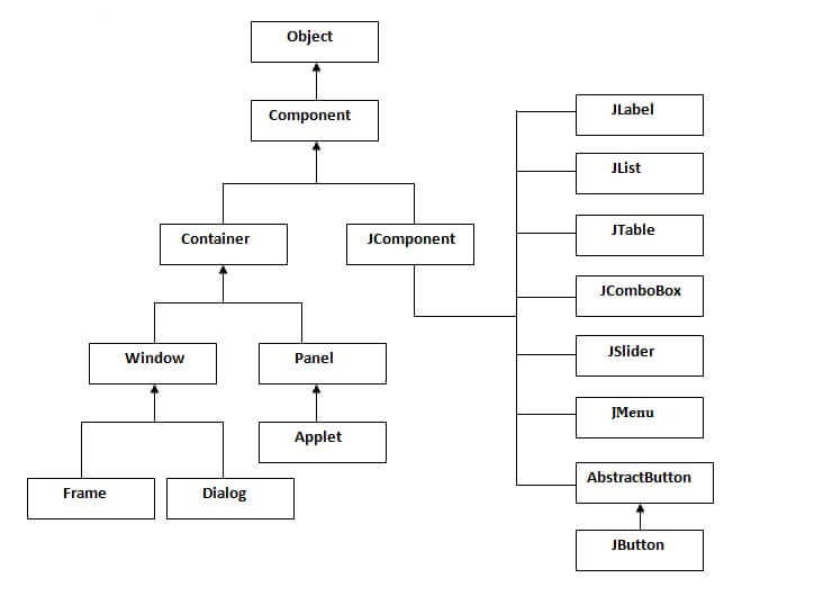

# THƯ VIỆN ĐỒ HOẠ SWING
## I. Thư viện đồ họa swing cơ bản
### 1. Tổng quan
- Swing là một thư viện giao diện người dùng (GUI) được sử dụng để **phát triển các ứng dụng desktop.** 
- Nó cung cấp **một loạt các container và component** để xây dựng giao diện người dùng phong phú và tương tác. 
- Trên thực tế, Swing là một bộ công cụ mạnh mẽ giúp **phát triển các ứng dụng GUI linh hoạt và đẹp mắt.** Với Swing, bạn có thể tạo ra các giao diện người dùng độc đáo và tương tác với người dùng **thông qua các component như nút bấm, trường văn bản, bảng, danh sách, vv.**
### 2. Swing containers và components
- Trong Java Swing, chúng ta có **các container và component** để xây dựng giao diện người dùng. 
- Các container được sử dụng để **chứa các component và có thể chứa các container khác.**

## II. JFrame, JButton, JLabel, JTextField, JTable, JList
### 1. JFrame
- **JFrame:** Là một container chính, đại diện cho một cửa sổ ứng dụng.
```java
import javax.swing.JFrame;
JFrame frame = new JFrame("My Swing App");
```
### 2. JButton
- **JButton:** Là một nút có thể nhấn được, thường được sử dụng để kích hoạt một hành động nào đó.

```java
import javax.swing.JButton;
JButton button = new JButton("Click me");
```
- **JLabel:** Là một nhãn dùng để hiển thị văn bản hoặc hình ảnh.

```java
import javax.swing.JLabel;
JLabel label = new JLabel("Hello, Swing!");
```
- **JTextField:** Là một ô văn bản cho phép người dùng nhập dữ liệu.

```java
import javax.swing.JTextField;
JTextField textField = new JTextField(20);
```
