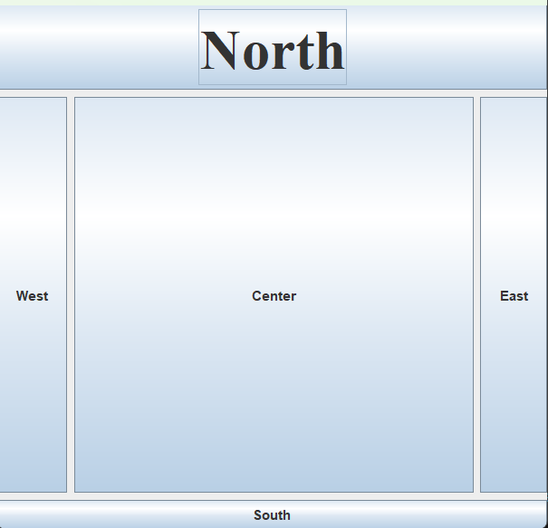
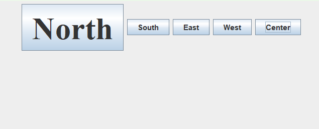
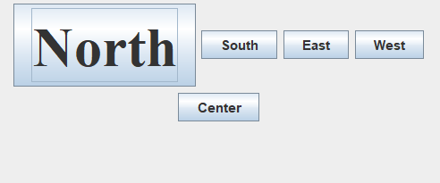
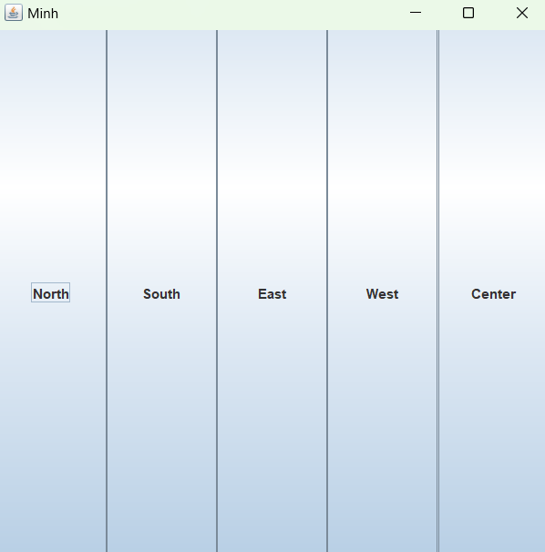
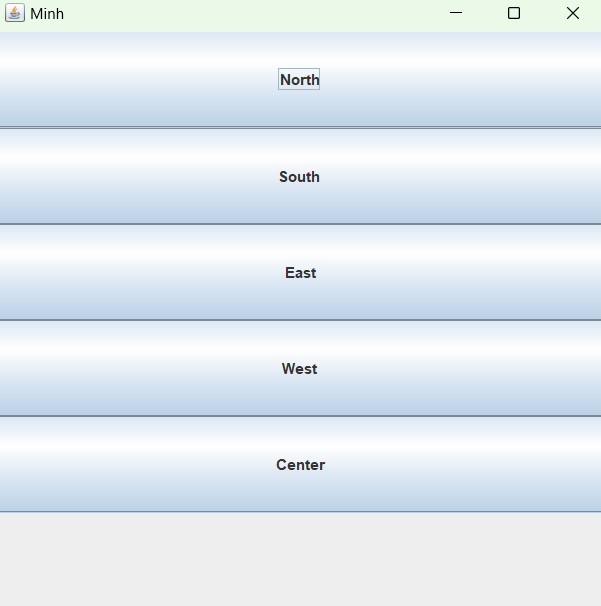
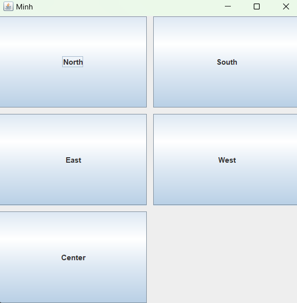
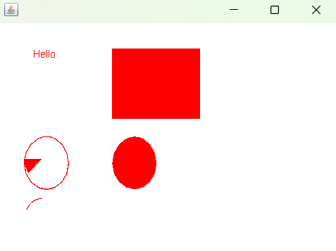
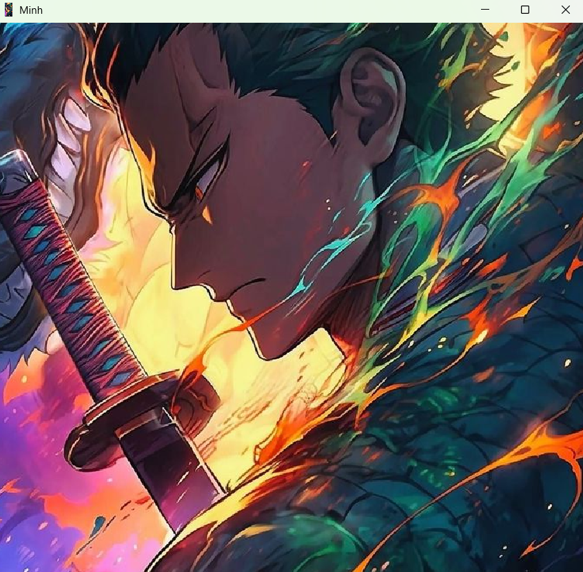

# THƯ VIỆN ĐỒ HOẠ SWING
## I. Thư viện đồ họa swing cơ bản
### 1. Tổng quan
- Swing là một thư viện giao diện người dùng (GUI) được sử dụng để **phát triển các ứng dụng desktop.** 
- Nó cung cấp **một loạt các container và component** để xây dựng giao diện người dùng phong phú và tương tác. 
- Trên thực tế, Swing là một bộ công cụ mạnh mẽ giúp **phát triển các ứng dụng GUI linh hoạt và đẹp mắt.** Với Swing, bạn có thể tạo ra các giao diện người dùng độc đáo và tương tác với người dùng **thông qua các component như nút bấm, trường văn bản, bảng, danh sách, vv.**
### 2. Swing containers và components
- Trong Java Swing, chúng ta có **các container và component** để xây dựng giao diện người dùng. 
- Các container được sử dụng để **chứa các component và có thể chứa các container khác.**

## II. JFrame, JButton, JLabel, JTextField, JTable, JList
### 1. JFrame
- **JFrame:** Là một container chính, đại diện cho một cửa sổ ứng dụng.
#### 1.1 Constuctor
- **JFrame():** Xây dựng một Frame mới, ban đầu là không nhìn thấy (invisible).
```java
JFrame frame = new JFrame("");
```
- **JFrame(String title):** Tạo một Frame mới, ban đầu là không nhìn thấy (invisible) với title đã cho.
```java
JFrame frame = new JFrame("Minh");
```
- **JFrame(GraphicsConfiguration gc):** Tạo một Frame trong GraphicsConfiguration đã cho của một thiết bị màn hình và một title trống.
```java
JFrame frame = new JFrame(gc);
```
- **JFrame(String title, GraphicsConfiguration gc):** Tạo một Frame với title đã cho và GraphicsConfiguration đã cho của một thiết bị màn hình.
```java
JFrame frame = new JFrame("Minh", gc);
```
- **Ví dụ**
```java
import javax.swing.JFrame;
import java.awt.GraphicsConfiguration;
import java.awt.GraphicsDevice;
import java.awt.GraphicsEnvironment;

public class Test {
    public static void main(String[] args) {
        // Lấy môi trường đồ họa của hệ thống
        GraphicsEnvironment ge = GraphicsEnvironment.getLocalGraphicsEnvironment();

        // Lấy một mảng các thiết bị đồ họa
        GraphicsDevice[] gdArray = ge.getScreenDevices();

        // Chọn một thiết bị đồ họa cụ thể
        GraphicsDevice gd = gdArray[0];

        // Lấy GraphicsConfiguration từ thiết bị đồ họa đã chọn
        GraphicsConfiguration gc = gd.getDefaultConfiguration();

        // Tạo JFrame với GraphicsConfiguration đã chọn
        JFrame frame = new JFrame("Minh", gc);

        // Thiết lập các thuộc tính khác của JFrame
        frame.setSize(400, 300);
        frame.setDefaultCloseOperation(JFrame.EXIT_ON_CLOSE);
        frame.setVisible(true);
    }
}
```
#### 1.2 Phương thức
- **setTitle(String nameTitle):** Đặt tiêu đề của JFrame.

- **setSize(int width, int height):** Đặt kích thước của JFrame.

- **setDefaultCloseOperation(int operation):** Đặt thao tác đóng mặc định cho JFrame. Các tùy chọn phổ biến bao gồm JFrame.EXIT_ON_CLOSE, JFrame.HIDE_ON_CLOSE và JFrame.DO_NOTHING_ON_CLOSE.

- **setVisible (boolean b):** Đặt khả năng hiển thị của JFrame. Vượt qua true để làm cho nó hiển thị và false để ẩn nó.

- **setLayout (LayoutManager manager):** Đặt trình quản lý bố cục cho JFrame, điều khiển cách các thành phần được sắp xếp trong khung.(Gồm BorderLayout, FlowLayout, BoxLayout);

- **add (Component comp):** Thêm một thành phần Swing vào JFrame.

- **remove (Component comp):** Loại bỏ một thành phần khỏi JFrame.

- **validate():** Buộc trình quản lý bố cục tính toán lại bố cục của các thành phần trong JFrame.

- **setResizable (boolean resizable):** Kiểm soát xem người dùng có thể thay đổi kích thước JFrame hay không.

- **setIconImage (Image image):** Đặt biểu tượng (hình ảnh) cho cửa sổ JFrame.

#### 1.3 Ví dụ
```java
import java.awt.BorderLayout;
import java.awt.Font;
import java.awt.Image;
import java.awt.Toolkit;
import javax.swing.JButton;
import javax.swing.JFrame;

public class Test {
    public static void main(String[] args) {
        JFrame frame = new JFrame("Minh");
        JButton b1 = new JButton("North");
        JButton b2 = new JButton("South");
        JButton b3 = new JButton("East");
        JButton b4 = new JButton("West");
        JButton b5 = new JButton("Center");
        frame.setLayout(new BorderLayout(6, 6));
        Font font = new Font("serif", Font.BOLD, 50);
        b1.setFont(font);
        frame.add(b1, BorderLayout.NORTH);
        frame.add(b2, BorderLayout.SOUTH);
        frame.add(b3, BorderLayout.EAST);
        frame.add(b4, BorderLayout.WEST);
        frame.setSize(500, 500);
        frame.setDefaultCloseOperation(JFrame.EXIT_ON_CLOSE);
        frame.setVisible(true);
        try {
            Thread.sleep(1000);
        } catch (InterruptedException e) {
            e.printStackTrace();
        }
        frame.add(b5, BorderLayout.CENTER);
        frame.validate();   
        frame.setResizable(false);
        Image icon = Toolkit.getDefaultToolkit().getImage("Mrbored.jpg");
        frame.setIconImage(icon);
    }
}

```
### 2. JButton
- **JButton:** Là một nút có thể nhấn được, thường được sử dụng để kích hoạt một hành động nào đó.

```java
import javax.swing.JButton;
import javax.swing.JFrame;

public class Test {
    public static void main(String[] args) {
        JFrame frame = new JFrame();
        frame.setTitle("Minh");
        frame.setSize(350, 350);
        frame.setDefaultCloseOperation(JFrame.EXIT_ON_CLOSE);
        JButton button = new JButton("Click");
        frame.add(button);
        frame.setVisible(true);
    }
}
```

- **JLabel:** Là một nhãn dùng để hiển thị văn bản hoặc hình ảnh.

```java
import javax.swing.JFrame;
import javax.swing.JLabel;

public class Test {
    public static void main(String[] args) {
        JFrame frame = new JFrame();
        frame.setTitle("Minh");
        frame.setSize(350, 350);
        frame.setDefaultCloseOperation(JFrame.EXIT_ON_CLOSE);
        JLabel label = new JLabel("HAHA");
        frame.add(label);
        frame.setVisible(true);
    }
}
```
- **JTextField:** Là một ô văn bản cho phép người dùng nhập dữ liệu.

```java
import javax.swing.JFrame;
import javax.swing.JTextField;

public class Test {
    public static void main(String[] args) {
        JFrame frame = new JFrame();
        frame.setTitle("Minh");
        frame.setSize(350, 350);
        frame.setDefaultCloseOperation(JFrame.EXIT_ON_CLOSE);
        JTextField text = new JTextField();
        frame.add(text);
        frame.setVisible(true);
    }
}
```
- **JTable**: được sử dụng để hiển thị và chỉnh sửa dữ liệu theo dạng Table
```java
import javax.swing.*;
class Test {
    public static void main(String[] args) {

        JFrame jFrame = new JFrame("Minh");
        jFrame.setSize(500, 200);
        jFrame.setLocationRelativeTo(null);
        String[][] data = {
                { "Nguyen", "Van", "Minh" },
                { "Tran", "Quang", "Manh" }
        };

        String[] cot = { "Ho", "Ten Dem", "Ten" };

        JTable jTable = new JTable(data, cot);
        JScrollPane sp = new JScrollPane(jTable);
        jFrame.add(sp);
        jFrame.setVisible(true);
    }
}
```
- **JList**: hiển thị một danh sách các mục văn bản
```java
import javax.swing.*;
class Test {
    public static void main(String[] args) {

        JFrame jFrame = new JFrame("Minh");
        jFrame.setSize(500, 200);
        jFrame.setLocationRelativeTo(null);
        DefaultListModel<String> l1 = new DefaultListModel<>();  
        l1.addElement("Item1");  
        l1.addElement("Item2");  
        l1.addElement("Item3");  
        l1.addElement("Item4");  
        JList<String> list = new JList<>(l1);  
        jFrame.add(list);  
        jFrame.setVisible(true);
    }
}
```
## III. BorderLayout, FlowLayout, GridLayout
### 1. BorderLayout
- Trình quản lý BorderLayout chia nền thành phần thành **năm khu vực**. Bạn **chỉ có thể thêm một thành phần trên mỗi vùng** thành một nền được kiểm soát bởi người quản lý BorderLayout. 
- Các thành phần được đặt ra bởi người quản lý này thường **không có được kích thước ưa thích**. BorderLayout là bố cục mặc định
quản lý cho một khung!
```java
import java.awt.BorderLayout;
import java.awt.Font;
import javax.swing.JButton;
import javax.swing.JFrame;

public class Test1 {
    public static void main(String[] args) {
        JFrame frame = new JFrame("Minh");
        JButton b1 = new JButton("North");
        JButton b2 = new JButton("South");
        JButton b3 = new JButton("East");
        JButton b4 = new JButton("West");
        JButton b5 = new JButton("Center");
        frame.setLayout(new BorderLayout(6, 6));
        Font font = new Font("serif", Font.BOLD, 50);
        b1.setFont(font);
        frame.add(b1, BorderLayout.NORTH);
        frame.add(b2, BorderLayout.SOUTH);
        frame.add(b3, BorderLayout.EAST);
        frame.add(b4, BorderLayout.WEST);
        frame.setSize(500, 500);
        frame.setDefaultCloseOperation(JFrame.EXIT_ON_CLOSE);
        frame.setVisible(true);
        try {
            Thread.sleep(1000);
        } catch (InterruptedException e) {
            e.printStackTrace();
        }
        frame.add(b5, BorderLayout.CENTER);
    }
}

```

### 2. FlowLayout
- FlowLayout hoạt động giống như **từ trong văn bản**. Mỗi thành phần có **kích thước như mong muốn**.
- Chúng được sắp xếp từ trái sang phải theo thứ tự chúng đã được thêm vào và bật tính năng "bọc từ". Vì thế khi một thành phần không vừa theo chiều ngang, nó sẽ **rơi xuống tới “dòng” tiếp theo trong bố cục.**
- FlowLayout là trình quản lý bố cục mặc định cho một bảng điều khiển!
```java
import java.awt.FlowLayout;
import java.awt.Font;
import javax.swing.JButton;
import javax.swing.JFrame;

public class Test1 {
    public static void main(String[] args) {
        JFrame frame = new JFrame("Minh");
        JButton b1 = new JButton("North");
        JButton b2 = new JButton("South");
        JButton b3 = new JButton("East");
        JButton b4 = new JButton("West");
        JButton b5 = new JButton("Center");
        frame.setLayout(new FlowLayout());
        Font font = new Font("serif", Font.BOLD, 50);
        b1.setFont(font);
        frame.add(b1);
        frame.add(b2);
        frame.add(b3);
        frame.add(b4);
        frame.add(b5);
        frame.setSize(500, 500);
        frame.setDefaultCloseOperation(JFrame.EXIT_ON_CLOSE);
        frame.setVisible(true);
    }
}
```


### 3. GridLayout
- Lớp **GridLayout** sắp xếp các thành phần trong một lưới hình chữ nhật. Một thành phần được hiển thị trong mỗi hình chữ nhật
- **GridLayout()**: Tạo một grid layout với mặc định là một cột mỗi thành phần, trong một hàng đơn.
```java
import java.awt.GridLayout;

import javax.swing.JButton;
import javax.swing.JFrame;

public class Test1 {
    public static void main(String[] args) {
        JFrame frame = new JFrame("Minh");
        JButton b1 = new JButton("North");
        JButton b2 = new JButton("South");
        JButton b3 = new JButton("East");
        JButton b4 = new JButton("West");
        JButton b5 = new JButton("Center");
        frame.setLayout(new GridLayout());
        frame.add(b1);
        frame.add(b2);
        frame.add(b3);
        frame.add(b4);
        frame.add(b5);
        frame.setSize(500, 500);
        frame.setDefaultCloseOperation(JFrame.EXIT_ON_CLOSE);
        frame.setVisible(true);
    }
}

```

- **GridLayout(int rows, int columns)**: Tạo một grid layout với số hàng và cột đã cho, và không có khoảng cách giữa các thành phần.
```java
import java.awt.GridLayout;

import javax.swing.JButton;
import javax.swing.JFrame;

public class Test1 {
    public static void main(String[] args) {
        JFrame frame = new JFrame("Minh");
        JButton b1 = new JButton("North");
        JButton b2 = new JButton("South");
        JButton b3 = new JButton("East");
        JButton b4 = new JButton("West");
        JButton b5 = new JButton("Center");
        frame.setLayout(new GridLayout(6, 2));
        frame.add(b1);
        frame.add(b2);
        frame.add(b3);
        frame.add(b4);
        frame.add(b5);
        frame.setSize(500, 500);
        frame.setDefaultCloseOperation(JFrame.EXIT_ON_CLOSE);
        frame.setVisible(true);
    }
}

```

- **GridLayout(int rows, int columns, int hgap, int vgap)**: Tạo một grid layout với các hàng và cột đã cho cùng với các khoảng cách theo chiều dọc và ngang đã xác định.
```java
import java.awt.GridLayout;

import javax.swing.JButton;
import javax.swing.JFrame;

public class Test1 {
    public static void main(String[] args) {
        JFrame frame = new JFrame("Minh");
        JButton b1 = new JButton("North");
        JButton b2 = new JButton("South");
        JButton b3 = new JButton("East");
        JButton b4 = new JButton("West");
        JButton b5 = new JButton("Center");
        frame.setLayout(new GridLayout(3, 2, 10, 10));
        frame.add(b1);
        frame.add(b2);
        frame.add(b3);
        frame.add(b4);
        frame.add(b5);
        frame.setSize(500, 500);
        frame.setDefaultCloseOperation(JFrame.EXIT_ON_CLOSE);
        frame.setVisible(true);
    }
}

```

## IV. Graphics2D, Image
### 1. Graphics2D
- Lớp Graphics trong Java cung cấp nhiều phương thức để lập trình đồ họa. 
- **public abstract void drawString(String str, int x, int y)**: được sử dụng để vẽ chuỗi đã cho.

- **public void drawRect(int x, int y, int width, int height):** vẽ một hình chữ nhật với độ rộng width và chiều cao height đã cho.

- **public abstract void fillRect(int x, int y, int width, int height):** được sử dụng để điền màu mặc định và độ rộng và chiều cao đã cho vào hình chữ nhật.

- **public abstract void drawOval(int x, int y, int width, int height):** được sử dụng để vẽ hình Ovan với độ rộng và chiều cao đã cho.

- **public abstract void fillOval(int x, int y, int width, int height):** được sử dụng để điền màu mặc định và độ rộng và chiều cao đã cho vào hình Oval.

- **public abstract void drawLine(int x1, int y1, int x2, int y2):** được sử dụng để vẽ line giữa hai điểm có tọa độ lần lượt là (x1, y1) và (x2, y2).

- public abstract boolean drawImage(Image img, int x, int y, ImageObserver observer): được sử dụng để vẽ hình ảnh đã cho.

- **public abstract void drawArc(int x, int y, int width, int height, int startAngle, int arcAngle):** được sử dụng để vẽ đường tròn circular hoặc elip.

- **public abstract void fillArc(int x, int y, int width, int height, int startAngle, int arcAngle):** được sử dụng để điền một hình tròn hoặc elip.

- **public abstract void setColor(Color c):** được sử dụng để thiết lập màu hiện tại của đồ họa thành màu color đã cho.

- **public abstract void setFont(Font font):** được sử dụng để thiết lập font hiện tại của đồ họa thành font đã cho.
```java
import java.awt.Canvas;
import java.awt.Color;
import java.awt.Graphics;
 
import javax.swing.JFrame;
 
public class Test extends Canvas {
    public void paint(Graphics g) {
        g.drawString("Hello", 40, 40);
        setBackground(Color.WHITE);
        g.fillRect(130, 30, 100, 80);
        g.drawOval(30, 130, 50, 60);
        setForeground(Color.RED);
        g.fillOval(130, 130, 50, 60);
        g.drawArc(30, 200, 40, 50, 90, 60);
        g.fillArc(30, 130, 40, 50, 180, 40);
 
    }
 
    public static void main(String[] args) {
        Test m = new Test();
        JFrame f = new JFrame();
        f.add(m);
        f.setSize(400, 300);
        f.setVisible(true);
    }
}
```

### 2. Image
- Lớp **ImageIcon** trong Java Swing là một trình triển khai của Icon Iterface, để vẽ các Icon từ các Image.
```java
import javax.swing.*;
class Test {
    public static void main(String[] args) {

        JFrame frame = new JFrame("Minh");
        frame.setSize(600, 600);
        frame.setLocationRelativeTo(null);
        ImageIcon icon = new ImageIcon("RoronoaZoro.jpg");
        JLabel label = new JLabel(icon);
        frame.setIconImage(icon.getImage());
        frame.add(label);
        frame.setVisible(true);
    }
}
```
